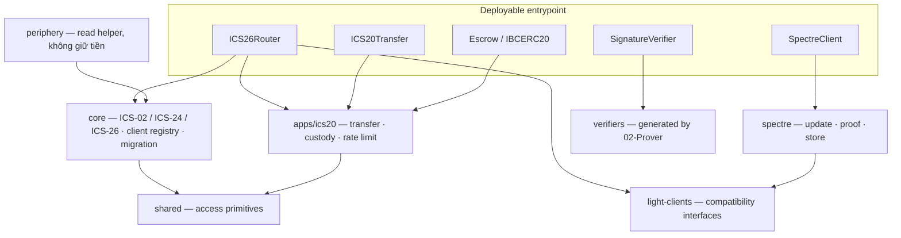

05
# Component 1 — Solidity Contracts

> [!abstract] Mục tiêu
> Refactor cấu trúc theo hướng behavior-preserving, giúp codebase Solidity dễ tìm hiểu, nhất quán và gọn hơn.

> [!warning] Điều kiện trước khi triển khai
> Hoàn tất và review chéo thiết kế này trước khi thay đổi production code.

## Phạm vi

### Trong phạm vi

- `ICS26Router` và phần ICS-02/ICS-24 storage/routing support mà nó quản lý.
- `ICS20Transfer`, `Escrow`, `IBCERC20`, rate limit và các library ICS-20.
- `SpectreClient`, `SignatureVerifier` cùng support cho update, proof, migration, storage và encoding.
- Interface, message, error, deployment script, generated-verifier integration, Foundry tests, package ownership, chuẩn đặt tên và chiều phụ thuộc.

### Ngoài phạm vi

- Protocol behavior, packet type, light-client algorithm, token/callback policy hoặc governance mới.
- Thay đổi public ABI hay storage layout chỉ để code sạch hơn.
- Thay đổi commitment, proof format/witness, quorum, pause/replay, rate limit, acknowledgement, proxy/beacon/module-call hoặc access control.
- Sửa thủ công generated files `contracts/verifiers/Groth16Verifier_N*.sol`.
- Thay đổi relayer, prover, attestor hoặc Wasm ngoài các binding/path updates bắt buộc.

Đây là refactor cấu trúc, không phải thiết kế lại IBC hay Spectre. Mọi thay đổi externally observable về success, failure, state, log, gas forwarding hoặc call ordering phải có thiết kế riêng được review.

### Chính sách ABI diff

ABI compatibility được kiểm ở hai lớp:

1. **Runtime ABI** gồm function/error selector, event topic/indexing và canonical type/tuple shape. Diff lớp này phải rỗng trong refactor.
2. **Tooling ABI** là full JSON, gồm `internalType`, source path và tên container dùng để sinh binding. Diff lớp này chỉ được phép trong rename-only slice có rename manifest, regenerated binding và consumer update cùng review unit.

Tên Solidity container không tham gia selector, nhưng có mặt trong `internalType` và tên type Go do abigen sinh. Vì vậy runtime ABI có thể giữ nguyên trong khi tooling ABI thay đổi có chủ đích; mọi báo cáo gate phải ghi rõ đang so lớp nào.

> [!note] Tính độc lập của tài liệu
> Kế hoạch này có thể được triển khai độc lập. Các Wasm proof consumer chỉ consume compatibility boundary của router commitment contract hiện tại; refactor của chúng không cần bắt đầu, hoàn tất hay pass trước kế hoạch này.

> [!important] Repository baseline prerequisite
> Trước khi bắt đầu một trong hai refactor plan, cần land một maintenance patch tối thiểu, không đổi behavior, để `cargo test --locked -p ibc-eureka-solidity-types` pass bằng cách pin ABI/generated input có thể tái tạo và đồng bộ Alloy binding bị stale. Patch này là repository hygiene dùng chung, không thuộc phase của refactor nào; sau khi patch land, 01 và 05 triển khai độc lập.

---

## 1. Input / output và lỗi

Solidity phục vụ user/app, relayer, governance/operator và build/deployment tooling. Return value, state write, log, revert, ABI, bytecode và storage layout đều là compatibility outputs.

### Runtime boundaries

| Boundary        | Input                                                                 | Successful output                              | State effect                         |
| --------------- | --------------------------------------------------------------------- | ---------------------------------------------- | ------------------------------------ |
| App ICS-26      | Registration, `sendPacket`                                            | Sequence và `SendPacket`                       | Registry, sequence, commitment       |
| Relayer ICS-26  | Update, receive, acknowledgement, timeout, misbehaviour               | Event, acknowledgement hoặc `Noop` có chủ đích | State client/packet                  |
| User/app ICS-20 | Transfer, approval/Permit2, callback                                  | Sequence hoặc callback hoàn tất                | Custody, mint/burn, rate-limit usage |
| Light client    | Header, proof, misbehaviour bytes                                     | Update result hoặc timestamp                   | Consensus/frozen/pinned state        |
| Governance      | Role, pause, upgrade, migration, verifier/beacon/escrow configuration | Event hoặc successful empty return             | Implementation/configuration         |
| View/tooling    | Query client, commitment, escrow, denom, verifier, role               | ABI-encoded data                               | None                                 |

Function/error selector, event topic/indexing, tuple ordering, return value, revert class và validation order phải giữ nguyên.

### Build và deployment boundaries

| Input | Output | Consumer |
|---|---|---|
| Source, import, Foundry configuration, dependency | ABI, bytecode, storage layout | CI, script, operator |
| Prover-generated verifier sources/selectors | Bucket-verifier deployments và registry | Spectre và [[02-Prover]] |
| Deployment configuration | Proxy, beacon, implementation, manager, module và verifier addresses | Governance và [[03-Relayer]] |
| ABI và fixture đa ngôn ngữ | Go binding, golden byte/hash | Relayer, prover, Wasm |

Malformed input, invalid protocol state, proof failure, token/callback failure, unauthorized upgrade, stale artifact, ABI drift và storage drift phải fail đúng như hiện tại hoặc sớm hơn tại compatibility gate tương ứng, không có partial write. Revert ordering là observable behavior và chỉ được đổi qua quyết định API rõ ràng.

---

## 2. Yêu cầu của component

### Yêu cầu chức năng

1. **Preserve public contract.** External/public function, event, custom error, selector, tuple và return không đổi.
2. **Preserve storage.** Namespace ERC-7201, thứ tự field, mapping key, inheritance storage behavior và immutable của deployable không đổi.
3. **Preserve protocol bytes.** Commitment, path, denom trace, Tendermint encoding, witness hash và acknowledgement phải byte-identical.
4. **Preserve transition ordering.** Verification, replay check, write/delete, callback, refund và event giữ nguyên thứ tự và atomicity.
5. **Preserve security semantics.** Client isolation, role, delayed migration, asymmetric pause, proof-before-noop, quorum và rate-limit accounting không đổi.
6. **Preserve upgrade behavior.** UUPS, beacon ownership, phiên bản initializer, migration module và governance script tiếp tục hỗ trợ deployment hiện có.
7. **Preserve generated boundaries.** Verifier source tiếp tục là generated code; witness layout và bucket dispatch compatible với artifact của prover.
8. **Explicit ownership.** Mỗi type, store, message, error và library có đúng một protocol owner; package ngang hàng dùng public interface, không import internal.
9. **Mirror production structure trong tests.** Test core, ICS-20, Spectre, shared, deployment và integration theo cấu trúc production sau khi refactor production hoàn tất.
10. **Chuẩn hóa tên nội bộ.** Biến, hàm private/internal, type, library, module, file, thư mục, test, fixture, comment và tài liệu dùng một tên canonical theo protocol owner; thuật ngữ Fast-IBC được đổi thành Spectre.

### Yêu cầu phi chức năng

| Mục tiêu          | Cách giải quyết                                               | Làm sao biết là đạt                                                                                 |
| ----------------- | ------------------------------------------------------------- | --------------------------------------------------------------------------------------------------- |
| Navigability      | Organize theo protocol package                                | Không còn `utils`, `msgs`, `errors` toàn cục                                                        |
| Phụ thuộc rõ ràng | Layer packages; cấm sibling internal imports                  | Import graph acyclic; lệnh architecture check chạy tay và output được ghi trong PR                   |
| Thin entrypoints  | Giữ orchestration dễ đọc; chuyển math/encoding/store về owner | Deployable không chứa bản sao của cùng rule                                                         |
| Compatibility     | Snapshot ABI, storage, size, gas, event/error, fixture        | Mọi diff đều rỗng hoặc được phân loại rõ                                                            |
| Bytecode safety   | Đo runtime size sau mỗi commit; tách structural move khỏi optimization | `ICS26Router` luôn dưới EIP-170; mọi thay đổi margin đều có số đo và giải thích                  |
| Bytecode headroom | Optimization slice riêng dùng size attribution, dead-code reachability và byte budget đã review | Mục tiêu 1 KiB chỉ bắt buộc khi budget chứng minh có thể giảm ít nhất 913 B mà không đổi ABI/behavior |
| Gas stability     | Benchmark các hot path packet và update                       | Không có regression trên 5% mà chưa giải thích                                                      |
| Reviewability     | Di chuyển từng ownership boundary                             | Mỗi production commit đều build và qua locked test                                                  |
| Test preservation | Map test cũ sang test tương đương hoặc mạnh hơn               | Không mất, yếu hóa hoặc thêm test ignored                                                           |
| Nhất quán tên     | Dùng thuật ngữ tiếng Anh/spec và rename manifest đã review    | Không còn tên nội bộ cũ; tên external cũ được giữ đều có lý do compatibility và điều kiện xóa alias |

Chuẩn đặt tên: tiếng Anh là canonical; một concept có một tên và một owner; dùng thuật ngữ IBC, Cosmos SDK, Ethereum, OP Stack, Arbitrum và Spectre theo `00-Common-Standards`. `I<Name>` dùng cho interface, `<Protocol>Msgs` cho message, `<Protocol>Errors` cho error, `<Protocol>Store` cho storage và `<Concept>Lib` cho domain library. `shared/` chỉ chứa code domain-neutral dùng bởi ít nhất hai package và không import ngược lên. Generated code và handwritten code luôn tách riêng.

Mọi rename được ghi trong manifest `tên hiện tại -> tên đích -> owner -> compatibility class -> consumer`. Tên nội bộ có thể đổi trực tiếp. Solidity runtime ABI, event/error selector, public struct/tuple shape, storage namespace/layout, generated-verifier contract và artifact là compatibility-locked. Tooling ABI name/path chỉ đổi trong coordinated consumer slice.

External import path có manifest riêng: first-party consumer trong repo được cập nhật atomically và chỉ xóa shim khi repository-wide stale-path check sạch; public/external hoặc chưa rõ consumer phải giữ forwarding shim, deprecation note và earliest-removal version. Consumer không xác định được mặc định được xem là public; phase cleanup không được xóa shim của nhóm này nếu chưa có migration/versioning review.

### Baseline và gates

Runtime evidence theo default profile hiện tại:

| Contract | Runtime size | Margin |
|---|---:|---:|
| `ICS26Router` | 24.465 B | 111 B |
| `ICS20Transfer` | 22.224 B | 2.352 B |
| `SpectreClient` | 19.390 B | 5.186 B |

Toàn bộ Solidity suite chưa phải baseline hợp lệ: `EVMRollupIBCFlowTest.t.sol` và `ReplayProofTest.t.sol` dừng đầu tiên vì thiếu generated file `contracts/verifiers/Groth16Verifier_N4.sol`. Phải khôi phục file qua [[02-Prover]], chạy lại suite và sửa mọi test wiring cũ còn lại mà không đổi production behavior trước khi refactor.

### Thứ tự gate bắt buộc

1. Khôi phục toàn bộ non-shadow-fork suite.
2. Ghi lại command, compiler/EVM/optimizer configuration, ABI digest, storage layout, size, gas và fixture digest.
3. Refactor production package dưới các assertion legacy không đổi.
4. Chạy gate nhanh sau mỗi commit và gate đầy đủ sau mỗi phase; lưu exact command và output trong PR body vì kế hoạch này chưa dựng required Solidity CI.
5. Chỉ tổ chức lại test sau khi hoàn tất production layout.

### Gate chạy tay và nơi ghi kết quả

| Nhịp | Gate bắt buộc | Evidence |
|---|---|---|
| Mỗi commit production/move | `forge fmt --check`, `forge build --skip test --skip script --sizes`, focused test, full `forge test`, runtime ABI diff | PR body ghi command, exit code, router size trước/sau và ABI digest |
| Cuối mỗi phase | Gate mỗi commit cộng storage/fixture/gas diff, binding generation, Rust consumer test, import graph, integration và deployment/verify test | Phase checklist trong PR body, kèm artifact/digest và link log |
| Final release validation | Toàn bộ final check ở §5 chạy hai lần từ clean build | Release checklist và compatibility manifest đã ký review |

Các check script phải exit non-zero khi drift, nhưng tài liệu không gọi chúng là required CI cho tới khi workflow trigger thực sự được thêm và bảo vệ branch được cấu hình.

---

## 3. Sơ đồ thiết kế và luồng refactor

Đích đến là **Protocol Package với Entrypoint Mỏng và Explicit Compatibility Boundaries**.



duc: **sơ đồ chưa cập nhật theo cây đích**, nên đang mâu thuẫn với chính thân bài ngay bên dưới. Bốn chỗ:

duc: 1) `SP` vẫn ghi `migration` — cây đích đã chuyển sang `core/client-registry/migration` và bỏ `spectre/migration`.

duc: 2) **cạnh `SP --> SH` giờ sai, phải xoá chứ không phải sửa nhãn.** Sau khi dời, không file Spectre nào còn phụ thuộc `shared/`:

```
$ grep -rln 'IBCRolesLib.sol\|IBCIdentifiers.sol' contracts/light-clients/
contracts/light-clients/modules/ClientMigrationExecutor.sol
contracts/light-clients/modules/ClientMigrationProposer.sol
```

Đúng hai file, và cả hai rời sang core theo cây mới. `shared/` giờ chỉ còn `IBCRolesLib` + `IBCIdentifiers`, Spectre không dùng cái nào.

duc: 3) thiếu node `periphery` — nó là package cấp 1 trong cây đích nhưng không có trong sơ đồ.

duc: 4) `E["Escrow / IBCERC20"]` là node mồ côi: khai trong `ENTRY` nhưng không có cạnh nào, trong khi `R --> APP` và `T --> APP` đều có. Thiếu `E --> APP`.

duc: đề nghị bản sửa:


`PER --> CORE` vì `RelayerHelper` đọc commitment/receipt store của router; chiều này đúng luật một chiều — periphery đứng trên core, không ai đứng trên periphery.

duc: ngoài sơ đồ, một chỗ trong cây: `ICS02ClientStore.sol` và `ICS02ClientUpgradeable.sol` **chính là cái registry**, nhưng đang rơi vào `core/store/` trong khi `client-registry/` chỉ chứa `migration/` — tức thư mục tên "client-registry" không chứa registry. Consumer của chúng đi liền một cụm (`ICS02ClientStore` ← hai file `ClientMigration*` + `ICS02ClientUpgradeable`; `ICS02ClientUpgradeable` ← `ICS26Router`), nên đưa cả hai vào `core/client-registry/` thì cụm liền mạch.

duc: và vì `periphery` là quy ước hệ Solidity (Uniswap core/periphery) chứ không phải từ spec IBC, nên thêm một dòng nghĩa trong cây để người đọc quen IBC không phải tự đoán — mình đề nghị: `periphery/relayer/  # không giữ tiền, không giữ state giao thức, thay được`. Đã kiểm `RelayerHelper`: toàn bộ hàm là `view`, không có hàm nào ghi state, nên nó khớp đúng nghĩa periphery.

**Dzung — phản hồi:** Đồng ý. Đã cập nhật sơ đồ theo cây đích: chuyển migration về core client registry, bỏ cạnh `SP --> SH`, thêm node `periphery` với cạnh `PER --> CORE`, và nối `Escrow / IBCERC20` vào `APP`. Cây đích giờ đặt `ICS02ClientStore.sol` cùng `ICS02ClientUpgradeable.sol` trực tiếp trong `core/client-registry/`; đồng thời chú thích `periphery/relayer/` là phần không giữ tiền, không giữ state giao thức và có thể thay thế.


### Cấu trúc đích

```text
contracts/
  core/
    ICS26Router.sol
    interfaces/ messages/ errors/
    client-registry/
      ICS02ClientStore.sol
      ICS02ClientUpgradeable.sol
      migration/
    store/ libraries/
    compatibility/ICS26AdminsDeprecated.sol
  apps/ics20/
    ICS20Transfer.sol
    Escrow.sol
    IBCERC20.sol
    interfaces/ messages/ errors/ store/ libraries/ rate-limit/
  light-clients/
    interfaces/ messages/
    spectre/
      SpectreClient.sol
      SignatureVerifier.sol
      interfaces/ messages/ errors/ modules/ store/ libraries/
  shared/
    access/                   # IBCRolesLib, IBCIdentifiers only
  periphery/relayer/             # không giữ tiền, không giữ state giao thức, thay được
    RelayerHelper.sol
  verifiers/                 # generated

test/
  core/ client-registry/ apps/ics20/ light-clients/spectre/
  shared/ periphery/ integration/ deployment/

out/                         # tmp.abi/tmp.bin; ignored, never under contracts/data
```

Ownership được giữ chặt: core sở hữu packet/client-registry state và generic ICS-02 migration; ICS-20 sở hữu token/custody; Spectre sở hữu consensus/proof; shared chỉ sở hữu primitive domain-neutral dùng chung; periphery sở hữu read helper cho relayer; verifiers chỉ chứa generated contracts. Core dùng interface app/light-client, ICS-20 dùng interface router, Spectre implement light-client ABI hiện tại. `light-clients/{interfaces,messages}` cố ý nằm trên `spectre/` để core phụ thuộc compatibility interface chứ không phụ thuộc một implementation cụ thể. Các compatibility import nằm trong public struct được giữ tới khi có thiết kế ABI vNext.

Mặc định không thêm external library deployment mới. Inheritance chỉ dùng cho storage/access thực sự dùng chung; pure computation dùng library; deployable boundaries dùng composition.

### Các luồng phải giữ nguyên

```text
ICS-26: validate → suy ra commitment → verify proof → write packet state
        → application callback → event

ICS-20: decode → phân loại native/voucher denom → custody hoặc mint/burn
        → rate-limit/refund accounting → router/callback → event

Spectre: decode/freshness → pinned snapshot và unique-signer quorum
         → module call hiện tại → validate kết quả → SpectreClient write state
```

Proof-before-noop, asymmetric pause, callback atomicity, exact balance, canonical acknowledgement, quorum và thứ tự event/error là các invariant trọng yếu. Mô hình `delegatecall`/`staticcall` hiện tại của Spectre được giữ nguyên.

### Thứ tự refactor

1. Baseline repair và lock compatibility artifacts.
2. Tạo skeleton package; di chuyển interface/message/error một cách cơ học, rồi chuẩn hóa symbol/file nội bộ trong commit rename-only riêng.
3. Di chuyển core và chỉ hợp nhất phần chuẩn bị packet/proof đã chứng minh trùng lặp.
4. Di chuyển ICS-20 và tách các named domain operations cho denom, custody, voucher, callback, refund và rate limit.
5. Di chuyển Spectre boundaries, module, store và witness support mà không đổi call semantic.
6. Cập nhật tên consumer, script, artifact path và Go bindings; runtime ABI diff phải rỗng, tooling ABI diff phải khớp rename manifest và stale-name search phải sạch.
7. Tổ chức lại test và fixture sau khi mọi production move đều qua gate.
8. Chỉ xóa shim của first-party consumer sau khi repository-wide import và artifact checks sạch; public/unknown-consumer shim tuân theo deprecation/versioning manifest.

Behavior fix phát hiện trong quá trình này phải là thay đổi riêng với test và quyết định thiết kế riêng.

---

## 4. Giao tiếp / phụ thuộc với component khác

| Component | Contract with Solidity |
|---|---|
| [[02-Prover]] | Generated verifier sources, bucket/selector, witness layout và public input; Phase 0 bị block cho tới readiness checkpoint với Hải |
| [[03-Relayer]] | ABI/selector/event, address, update/proof byte và ABI-generated Go bindings. Rename `IICS07TendermintMsgs*` sang Spectre là coordinated tooling-ABI slice: Solidity regenerate, relayer E2 cập nhật và test cùng review unit; relayer không tự đổi nửa Solidity |
| [[04-Attestor]] | Không thêm phụ thuộc trực tiếp ở runtime |
| Wasm proof consumer | Router identity, commitment slot/path/value encoding, absence semantic |
| Governance/operations | Proxy/beacon ownership, role/delay, initializer calldata, address implementation/module/verifier |
| OpenZeppelin/Foundry | Proxy/access/token behavior và compiler/EVM/artifact tái lập được |

Most fragile boundaries gồm router commitment với Wasm proof, Spectre witness với prover circuit, ABI/event với relayer binding, upgradeable implementation với stored state, và validation order/callback với user-visible errors.

Fixture gate/release gồm runtime ABI/selector manifest, tooling ABI rename diff, golden ICS-24 commitment và storage slot, golden Tendermint encoding, golden Spectre witness/public input cho từng bucket, cùng deployment manifest chứa address, code hash, ABI/storage digest và artifact version.

## 5. Kế hoạch triển khai

Triển khai theo các work package có gate và review độc lập. Package sau chỉ bắt đầu khi package trước pass locked compatibility suite.

| Phase                 | Công việc                                                                                                                                                                                                                  | Exit gate                                                                                                                    |
| --------------------- | -------------------------------------------------------------------------------------------------------------------------------------------------------------------------------------------------------------------------- | ---------------------------------------------------------------------------------------------------------------------------- |
| 0. Khôi phục baseline | Regenerate/verify `Groth16Verifier_N4.sol` qua [[02-Prover]]; sửa Solidity test wiring cũ; inventory cả `ReplayProofTest`, `EVMRollupIBCFlowTest` và `test/spectre/BenchGroth16Verifier_N4.sol`; ghi manifest test/ABI/storage/size/gas/verifier/fixture/binding, target layout và import-path consumer class | Full Foundry baseline và `cargo test --locked -p ibc-eureka-solidity-types` pass; mọi tracked source/test/temp output có target owner/path; không test nào bị làm yếu hoặc ignore thêm |
| 1. Thêm gate | Thêm compatibility/import-graph check; sửa `contracts/compile.sh` để resolve fully qualified artifact và ghi temp vào ignored `out/` | Cố ý làm drift ABI, storage, fixture, import, verifier hoặc size khiến check script exit non-zero; baseline không đổi pass; output được ghi trong PR body |
| 2. Di chuyển và đặt tên surface | Di chuyển interface/message/error của core, ICS-20 và light client về owner; commit move cơ học trước, rồi rename-only cho tên nội bộ và cập nhật consumer | Diff ABI/storage/fixture rỗng; stale-name search sạch; global type directory chỉ còn temporary shim đã document |
| 3. Core | Di chuyển/làm gọn router, ICS-02/24 store/library, relayer helper và deprecated-admin compatibility | Router/core/replay/integration/deployment test pass; commitment byte không đổi; router không mất size margin |
| 4. ICS-20 | Di chuyển transfer, escrow, token, callback, rate limit và owned library; chỉ extract domain operation thực sự trùng | ABI/storage/denom/ack byte của ICS-20 không đổi; custody, refund, rate-limit, integration, size và gas gate pass |
| 5. Spectre | Đặt client, verifier, module, store, validator-set và encoding support cạnh nhau; không sửa generated verifier bằng tay | ABI/storage/module selector và witness/public-input digest không đổi; Spectre/proof suite pass |
| 6. Consumer | Cập nhật script, Rust source include, Go binding generation, relayer binding, deployment path, docs, check script và coverage | Runtime ABI diff rỗng; tooling ABI diff khớp manifest; binding/Rust/relayer/deployment check pass; stale-path first-party toàn repo rỗng |
| 7. Test/release cleanup | Sắp test theo package, chứng minh mọi mapping legacy-to-new, chỉ xóa first-party shim đủ điều kiện, chạy clean release validation hai lần | Không test biến mất; compatibility/import-path manifest sạch; mọi deployable fit EIP-170 và gas gate đã duyệt |
| 8. Bytecode optimization | Lập reachability report và reviewed byte budget; bỏ từng dead/duplicate candidate trong review unit riêng, không trộn với structural move | EIP-170 luôn pass; ABI/storage/fixture byte-identical; 1 KiB chỉ thành mandatory khi approved budget đạt ít nhất 913 B và benchmark thực tế xác nhận |

Mỗi production slice dùng cùng một vòng:

1. Di chuyển một ownership boundary mà không rename hoặc sửa semantic.
2. Trong commit kế tiếp, áp dụng rename manifest mà không đổi behavior; cập nhật mọi source, test, script, generator và document consumer.
3. Chạy focused test, full `forge test`, size/build check và compatibility comparison.
4. Chỉ regenerate binding sau khi ABI comparison rỗng; inspect mọi bytecode diff.
5. Ghi exact command, size/gas trước-sau, compatibility result, known gap và rollback point.

### Final check bắt buộc

```text
forge fmt --check
forge build --skip test --skip script --sizes
forge test
cargo test --locked -p ibc-eureka-solidity-types
binding generation + relayer Go tests
production deploy/verify tests
ABI/storage/fixture/verifier/gas/size comparison
naming-manifest, stale-name, stale-path and import-graph checks
```

Behavior fix, dependency upgrade, test reorganization và production file move là các review unit riêng. Focused test xanh không bao giờ được dùng để bỏ qua compatibility, deployment hoặc size gate đang đỏ.

---

## Quyết định

### Đã chấp nhận

- Đây là refactor cấu trúc theo hướng behavior-preserving; protocol improvement là dự án riêng.
- Source code được tổ chức theo protocol owner với deployable orchestration boundary mỏng.
- Core chỉ phụ thuộc compatibility interface, không phụ thuộc implementation ICS-20 hoặc Spectre.
- Generated verifier tiếp tục là generated leaf.
- Semantic upgrade, access, module-call, pause, replay, rate-limit và witness hiện tại không đổi.
- Production move chạy dưới locked legacy test; test cleanup thực hiện sau.
- Chuẩn đặt tên của tài liệu 00 được áp dụng qua rename manifest; tên nội bộ được đổi trực tiếp, còn tên compatibility-locked chỉ đổi qua alias hoặc migration/versioning riêng.
- Dùng `<Protocol>Errors`; rename container được phép trong tooling ABI slice nhưng error selector phải giữ nguyên và binding consumer phải regenerate cùng review unit.
- EIP-170 là size gate bắt buộc; mục tiêu 1 KiB chỉ mandatory sau reviewed byte budget đạt ít nhất 913 B trong optimization slice riêng.
- First-party import path có thể xóa shim sau atomic update và repository-wide check; public/unknown import path phải có shim, deprecation và earliest-removal version.

### Còn mở

- Di chuyển từng package hay một commit cơ học toàn repo; khuyến nghị từng package.
- Deprecated initializer/admin path nào vẫn cần cho deployment đang được hỗ trợ.
- Ngưỡng gas cuối cùng sau khi dựng lại baseline; size policy đã chốt như trên.
- External tooling có yêu cầu giữ nguyên fully qualified verifier artifact path hay không.

## Tài liệu tham khảo

- [[00-Common-Standards]]
- [[02-Prover]]
- [[03-Relayer]]
- [Kiến trúc](../ARCHITECTURE.md)
- [Bảo mật](../SECURITY.md)
- [Chất lượng](../QUALITY.md)
- [cosmos/solidity-ibc-eureka](https://github.com/cosmos/solidity-ibc-eureka)
- [Đặc tả IBC v2](https://github.com/cosmos/ibc/tree/main/spec)
- [OpenZeppelin Contracts Upgradeable](https://github.com/OpenZeppelin/openzeppelin-contracts-upgradeable)

**Dong**: “Kế hoạch 01 đã khóa khá tốt ABI, storage, fixture và generated-verifier boundary. Tuy nhiên target ‘router còn ít nhất 1 KiB’ chưa có byte-budget hay work package chứng minh khả thi: baseline hiện chỉ còn 111 B dưới EIP-170, nên structural refactor không tự bảo đảm có thêm headroom. Ngoài ra external import path được gọi là compatibility-locked nhưng phase cuối lại xóa shim, chưa có policy phân biệt first-party consumer với public consumer. Đề nghị tách bytecode reduction thành optimization slice có budget/benchmark riêng, và thêm import-path compatibility manifest với shim/deprecation/versioning rõ ràng. Acceptance criterion: mọi move giữ ABI/storage/fixture byte-identical; router đạt EIP-170, còn mục tiêu 1 KiB chỉ được coi là mandatory khi có giảm-byte budget đã review.”

**Dzung — phản hồi:** Đồng ý. Đã tách Phase 8 bytecode optimization với reachability report, per-candidate budget và benchmark; structural phases chỉ bắt buộc giữ EIP-170. Import-path manifest giờ phân first-party, public và unknown consumer; chỉ first-party shim đủ điều kiện mới được xóa ở cleanup, còn public/unknown phải có deprecation/versioning. Acceptance gate giữ runtime ABI/storage/fixture byte-identical; tooling ABI chỉ đổi theo coordinated rename manifest.
