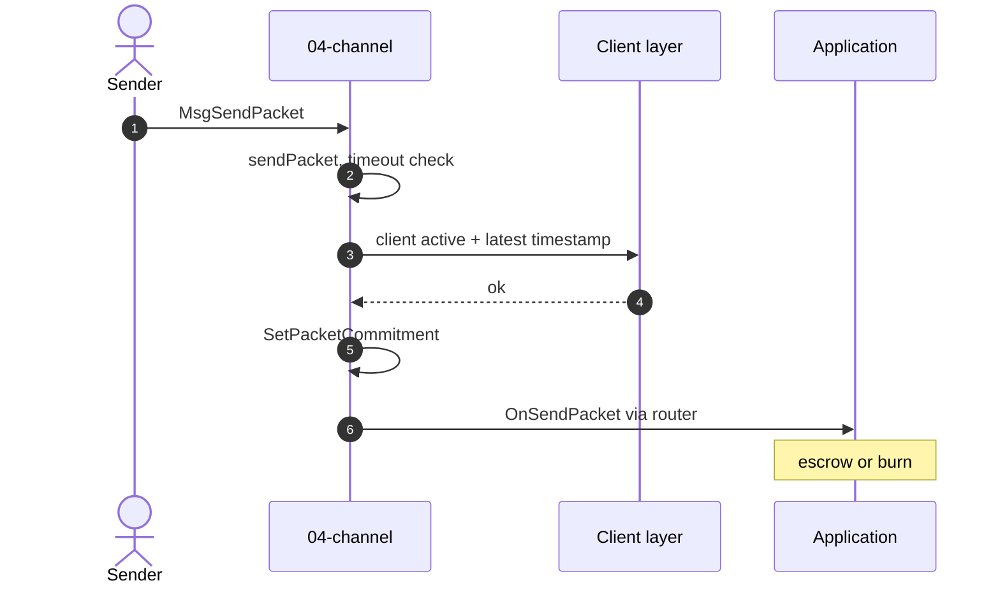
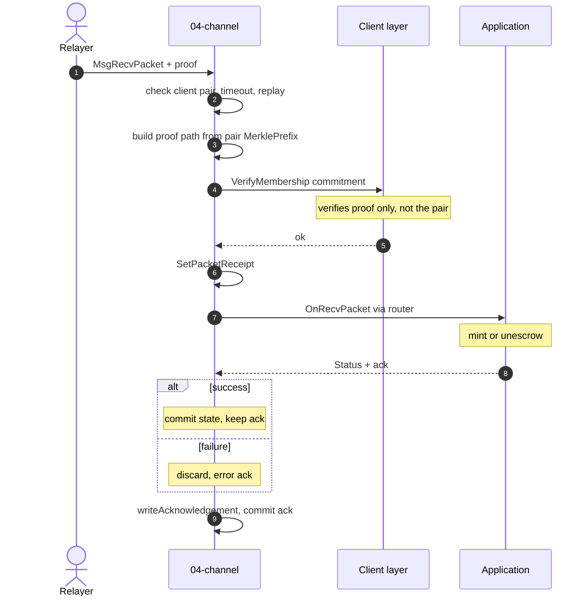
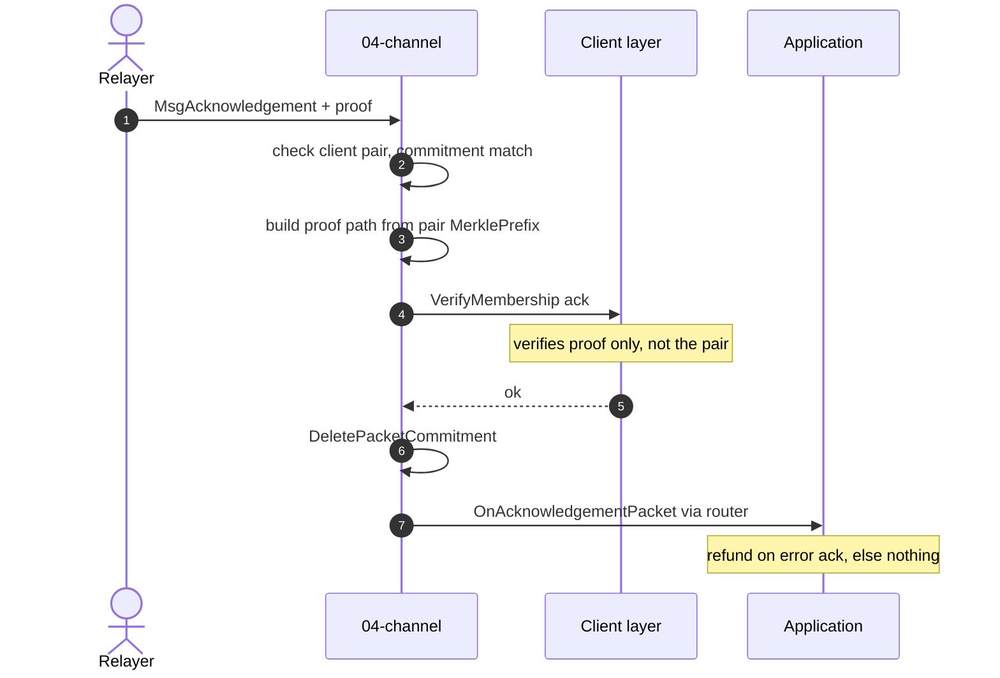
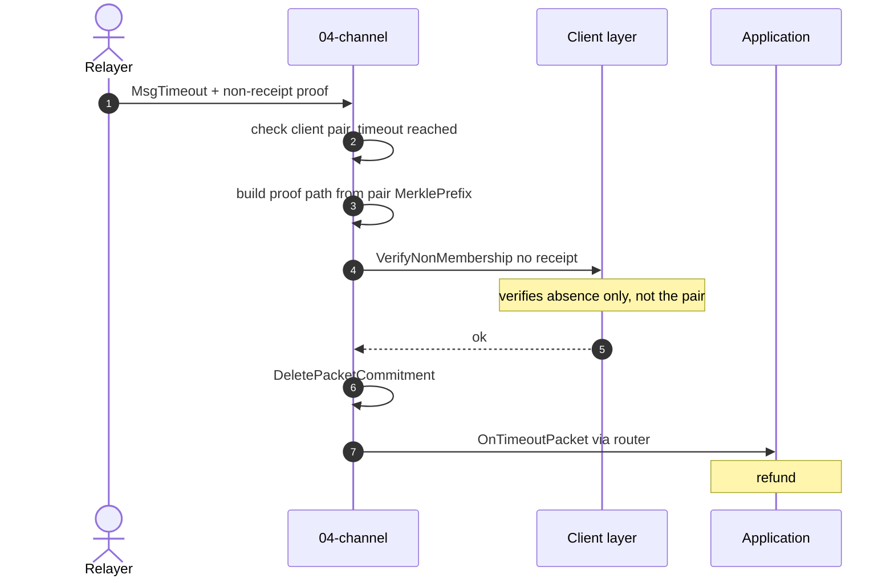

# The Channel Layer (`04-channel/v2`)

The channel layer (`04-channel/v2`) moves packets between two chains, responsible for handling packet flow, as well as packet management.
- **[Packet flow](#packet-flow)** — the four operations (send, receive, acknowledge, timeout), each end to end with its diagram and function calls.
- **[Packet management](#packet-management)** — what the channel stores per packet: the packet structure, and the commitments that give verifiability, replay protection, and sequencing.

**No per-application channel instance.** v2 has no channel object bound to a single client and a single app. The channel layer holds only the responsibilities above and resolves its dependencies **per packet**: the **client** by the packet's client ID (for proof verification), and the **application** by the payload's port (for the callback, through the [router](https://github.com/cosmos/ibc-go/blob/v10.3.0/modules/core/api/router.go)). Clients and apps are external instances the channel dispatches into, not parts wired into a channel object. This decouples transport from both verification and application logic.

## Packet flow

A packet moves through up to four operations. Each runs on-chain, with the application executing in a callback the channel dispatches through the **router** by port, and the three cross-chain steps (Receive, Acknowledge, Timeout) each carry a proof the **Client layer** verifies before any state moves.

- **Send** (source) commits the chain to an outbound packet and locks the value behind it.
- **Receive** (destination) accepts the packet by proving it really happened on the source, then delivers it to the app.
- **Acknowledge** (source) closes the loop, telling the sender how the destination handled the packet and settling accordingly.
- **Timeout** (source) reclaims a packet the destination never received, so nothing stays locked forever.

Receive then Acknowledge is the happy path. Timeout is the fallback.

Each cross-chain step first checks the **client pair**. The handler looks up the packet's counterparty and requires its `ClientId` to match the packet's other side, else [`ErrInvalidCounterparty`](https://github.com/cosmos/ibc-go/blob/v10.3.0/modules/core/04-channel/v2/keeper/packet.go#L114), then [builds the proof path](https://github.com/cosmos/ibc-go/blob/v10.3.0/modules/core/04-channel/v2/keeper/packet.go#L134) from the counterparty's `MerklePrefix` and hands it to the [**Client layer**'s `VerifyMembership`](https://github.com/cosmos/ibc-go/blob/v10.3.0/modules/core/04-channel/v2/keeper/packet.go#L138). `VerifyMembership` is **pairing-agnostic**, it verifies the proof against the path it is given and nothing more, so the pair both gates the step and tells the verifier where to read. Send only needs the pair to exist, to name the destination client. The pair is registered once at the client layer (see [the client pair](03-client-registry.md#client-counterparty)).

### Send (source chain)

The **sender** submits `MsgSendPacket` to the channel, not to the application. The channel's [`SendPacket`](https://github.com/cosmos/ibc-go/blob/v10.3.0/modules/core/04-channel/v2/keeper/msg_server.go#L20) handler runs [`sendPacket`](https://github.com/cosmos/ibc-go/blob/v10.3.0/modules/core/04-channel/v2/keeper/packet.go#L21), which checks the timeout is in range and the source client is active, then writes the [**packet commitment**](https://github.com/cosmos/ibc-go/blob/v10.3.0/modules/core/04-channel/v2/keeper/packet.go#L85). Only then does it route to the app by port and call [`OnSendPacket`](https://github.com/cosmos/ibc-go/blob/v10.3.0/modules/apps/transfer/v2/ibc_module.go#L36), where the app **escrows** a native token or **burns** a returning voucher. No proof is needed here, since the chain is committing its own outbound packet rather than verifying anything about the counterparty's state.



### Receive (destination chain)

The relayer submits `MsgRecvPacket` with a proof. [`recvPacket`](https://github.com/cosmos/ibc-go/blob/v10.3.0/modules/core/04-channel/v2/keeper/packet.go#L102) checks the counterparty pairing, the timeout, and the receipt for replay, then the **Client layer** [verifies the commitment proof](https://github.com/cosmos/ibc-go/blob/v10.3.0/modules/core/02-client/keeper/keeper.go#L337) against the source chain. The channel writes a [**receipt**](https://github.com/cosmos/ibc-go/blob/v10.3.0/modules/core/04-channel/v2/keeper/packet.go#L151), dispatches [`OnRecvPacket`](https://github.com/cosmos/ibc-go/blob/v10.3.0/modules/apps/transfer/v2/ibc_module.go#L86) where the app **mints** a voucher or **unescrows**, and commits the [**acknowledgement**](https://github.com/cosmos/ibc-go/blob/v10.3.0/modules/core/04-channel/v2/keeper/packet.go#L162). A failed callback is discarded and returns the sentinel error ack.



### Acknowledge (source chain)

The relayer submits `MsgAcknowledgement` with a proof. [`acknowledgePacket`](https://github.com/cosmos/ibc-go/blob/v10.3.0/modules/core/04-channel/v2/keeper/packet.go#L227) matches the stored commitment, the **Client layer** [verifies the ack proof](https://github.com/cosmos/ibc-go/blob/v10.3.0/modules/core/02-client/keeper/keeper.go#L337), and the channel [**deletes the commitment**](https://github.com/cosmos/ibc-go/blob/v10.3.0/modules/core/04-channel/v2/keeper/packet.go#L269). [`OnAcknowledgementPacket`](https://github.com/cosmos/ibc-go/blob/v10.3.0/modules/apps/transfer/v2/ibc_module.go#L166) finalizes, refunding only on an error ack.



### Timeout (source chain)

If the packet is never received before its deadline, the relayer submits `MsgTimeout`. [`timeoutPacket`](https://github.com/cosmos/ibc-go/blob/v10.3.0/modules/core/04-channel/v2/keeper/packet.go#L285) confirms the timeout elapsed, the **Client layer** [verifies the receipt is absent](https://github.com/cosmos/ibc-go/blob/v10.3.0/modules/core/02-client/keeper/keeper.go#L351) (non-membership), and the channel [**deletes the commitment**](https://github.com/cosmos/ibc-go/blob/v10.3.0/modules/core/04-channel/v2/keeper/packet.go#L347). [`OnTimeoutPacket`](https://github.com/cosmos/ibc-go/blob/v10.3.0/modules/apps/transfer/v2/ibc_module.go#L150) **refunds** the sender.




## Packet management

The channel never stores whole packets. For each one it writes small entries into the ICS-24 [**provable store**](https://github.com/cosmos/ibc-go/blob/v10.3.0/modules/core/24-host/v2/packet_keys.go), keyed by client ID and sequence, and these entries signal the state of the packet. 
- A [**commitment**](https://github.com/cosmos/ibc-go/blob/v10.3.0/modules/core/04-channel/v2/keeper/keeper.go#L135) is written on send and means the packet is in flight, then deleted once the packet is acknowledged or timed out. 
- A [**receipt**](https://github.com/cosmos/ibc-go/blob/v10.3.0/modules/core/04-channel/v2/keeper/keeper.go#L90) on the destination means the packet arrived, and the source proves it *absent* to justify a timeout. 
- An [**acknowledgement**](https://github.com/cosmos/ibc-go/blob/v10.3.0/modules/core/04-channel/v2/keeper/keeper.go#L109) on the destination carries the outcome the source reads back on acknowledge. 
These entries stay in sync between the two chains through the flow above, so each chain knows the packet's current state.

That same bookkeeping is what stops **double execution**. On receive, `recvPacket` [checks for an existing receipt first](https://github.com/cosmos/ibc-go/blob/v10.3.0/modules/core/04-channel/v2/keeper/packet.go#L126) and returns a no-op if it finds one, so a relayer resubmitting the same `MsgRecvPacket` never runs the app twice. Acknowledge and timeout are guarded by the commitment instead: once it is [deleted](https://github.com/cosmos/ibc-go/blob/v10.3.0/modules/core/04-channel/v2/keeper/packet.go#L269), the repeat is a [no-op](https://github.com/cosmos/ibc-go/blob/v10.3.0/modules/core/04-channel/v2/keeper/packet.go#L244), so a packet cannot be acknowledged twice, nor acknowledged and then timed out.

The channel keeps a **separate send-sequence counter for each client pair** (since each client pair symbolize a connection of a chain pair), that is `NextSequenceSend`, which counterparty registration [sets to 1](https://github.com/cosmos/ibc-go/blob/v10.3.0/modules/core/keeper/msg_server.go#L72) and every send [increments](https://github.com/cosmos/ibc-go/blob/v10.3.0/modules/core/04-channel/v2/keeper/packet.go#L84). A packet's sequence is essentially an **index**: it uniquely identifies that packet within its client pair and forms part of the key to its provable-store entries, so the chain can address, prove, and replay-check any single packet. 
### The packet 

A v2 packet has five fields. The top level is pure transport (who, when, ordering). The **application data lives inside `Payloads`**.

| Field               | Type   | Meaning                                    |
| ------------------- | ------ | ------------------------------------------ |
| `Sequence`          | uint64 | Per-client index of this packet            |
| `SourceClient`      | string | Sender's client ID for the destination     |
| `DestinationClient` | string | Destination's client ID for the sender     |
| `TimeoutTimestamp`  | uint64 | Absolute expiry, in seconds                |
| `Payloads`          | list   | One or more application messages (below)   |

Each entry in `Payloads` is one **application message** and carries all the app-level info ([`modules/core/04-channel/v2/types/packet.pb.go`](https://github.com/cosmos/ibc-go/blob/v10.3.0/modules/core/04-channel/v2/types/packet.pb.go)):

| Payload field       | Type   | Meaning                                                        |
| ------------------- | ------ | ------------------------------------------------------------- |
| `SourcePort`        | string | The sending application's port                                |
| `DestinationPort`   | string | The receiving application's port, which the router uses to pick the `IBCModule` |
| `Version`           | string | The application's version                                     |
| `Encoding`          | string | How `Value` is encoded (JSON, protobuf, or ABI)              |
| `Value`             | bytes  | The application's actual message                              |

So routing to an app and its versioning are **per-payload**, not per-channel, and there are no ports or channels at the packet level. Timeouts are timestamp-only, with no height field.

### The provable store

For each packet the channel writes fixed-size fingerprints into its **provable store**, the part of state a light client can prove membership or non-membership of. ("Commitment" does double duty in IBC: it names this store and also the specific send-side entry below.) Keys are `clientID || prefix-byte || bigEndian64(sequence)` ([`modules/core/24-host/v2/packet_keys.go`](https://github.com/cosmos/ibc-go/blob/v10.3.0/modules/core/24-host/v2/packet_keys.go)):

| Entry           | Key                           | Value                       | Place                |
| --------------- | ----------------------------- | --------------------------- | -------------------- |
| Commitment      | `clientID \|\| 0x01 \|\| seq` | Hash of the packet (below)  | Source chain         |
| Receipt         | `clientID \|\| 0x02 \|\| seq` | The byte `0x02`             | Dest chain           |
| Acknowledgement | `clientID \|\| 0x03 \|\| seq` | Hash of the acknowledgement | Dest chain           |

The commitment is a nested SHA-256 hash, not the raw packet:

```
CommitPacket = sha256( 0x02 || sha256(destinationClient)
                       || sha256(bigEndian64(timeoutTimestamp))
                       || sha256( concat hashPayload(p) ) )
hashPayload(p) = sha256( sha256(sourcePort) || sha256(destPort)
                         || sha256(version) || sha256(encoding) || sha256(value) )
```

Both sides prepend the same constant `0x02` (`byte(2)` in commitment.go, `uint8(2)` in [`contracts/utils/ICS24Host.sol`](https://github.com/decentrio/fast-ibc/blob/main/contracts/utils/ICS24Host.sol)), and the fixed-length preimage guards against malleability. Acknowledgements commit the same way, over the ack's `AppAcknowledgements` list ([`modules/core/04-channel/v2/types/commitment.go`](https://github.com/cosmos/ibc-go/blob/v10.3.0/modules/core/04-channel/v2/types/commitment.go)). These hashes are what the counterparty proves against. The Cosmos side verifies Ethereum's mirror of them in [the Ethereum light client](05-eth-light-client.md).


# Implementation Details

## Store

The channel writes two kinds of entry, both keyed under the client ID:

- **Provable** (commitment, receipt, acknowledgement), the entries a counterparty proves. Their keys and values are in [The provable store](#the-provable-store).
- **Local**, this chain only, never proven across chains:

| Key | Value | Notes |
| --- | ----- | ----- |
| `clientID` ([`NextSequenceSendKey`](https://github.com/cosmos/ibc-go/blob/v10.3.0/modules/core/24-host/v2/packet_keys.go#L52)) | `uint64` | the send counter, one per client pair, seeded to 1 at registration and bumped per send |
| `clientID \|\| "async_packet" \|\| seq` ([`AsyncPacketKey`](https://github.com/cosmos/ibc-go/blob/v10.3.0/modules/core/04-channel/v2/types/keys.go#L17)) | the packet | set only when a receiving app defers its ack, cleared once the ack is written. The one case the channel stores a whole packet |

## Event

Every operation emits one event, and together they are the **relayer's whole input**. The channel stores only fingerprints, so the packet itself travels in the log: each event carries `encoded_packet_hex`, the full packet in hex, which the relayer decodes to build the next message without the chain ever serving a raw packet. `write_acknowledgement` adds `encoded_acknowledgement_hex`, the ack bytes the source needs to acknowledge. All five also carry the client pair, sequence, and timeout ([`types/events.go`](https://github.com/cosmos/ibc-go/blob/v10.3.0/modules/core/04-channel/v2/types/events.go#L11), emitted in [`keeper/events.go`](https://github.com/cosmos/ibc-go/blob/v10.3.0/modules/core/04-channel/v2/keeper/events.go#L15)).

| Event | Emitted on | Chain | Relayer's next step |
| ----- | ---------- | ----- | --------------------- |
| `send_packet` | Send | source | submit `MsgRecvPacket` on the destination |
| `recv_packet` | Receive | dest | confirms delivery |
| `write_acknowledgement` | Receive | dest | submit `MsgAcknowledgement` on the source |
| `acknowledge_packet` | Acknowledge | source | close the packet |
| `timeout_packet` | Timeout | source | close the packet |

So the lifecycle reads as an event loop: `send_packet` on the source triggers receive, `write_acknowledgement` on the destination triggers acknowledge, and the commitment is cleared.

## Messages

The `Msg` service defines four messages, one per operation in [Packet flow](#packet-flow). Each message type is handled by the matching MsgServer method:

| Message | Handler | Caller | Proof it carries |
| ------- | ------- | ------ | ---------------- |
| [`MsgSendPacket`](https://github.com/cosmos/ibc-go/blob/v10.3.0/modules/core/04-channel/v2/types/tx.pb.go#L70) | [`SendPacket`](https://github.com/cosmos/ibc-go/blob/v10.3.0/modules/core/04-channel/v2/keeper/msg_server.go#L20) | sending application | none |
| [`MsgRecvPacket`](https://github.com/cosmos/ibc-go/blob/v10.3.0/modules/core/04-channel/v2/types/tx.pb.go#L149) | [`RecvPacket`](https://github.com/cosmos/ibc-go/blob/v10.3.0/modules/core/04-channel/v2/keeper/msg_server.go#L47) | relayer | the commitment |
| [`MsgAcknowledgement`](https://github.com/cosmos/ibc-go/blob/v10.3.0/modules/core/04-channel/v2/types/tx.pb.go#L307) | [`Acknowledgement`](https://github.com/cosmos/ibc-go/blob/v10.3.0/modules/core/04-channel/v2/keeper/msg_server.go#L156) | relayer | the acknowledgement |
| [`MsgTimeout`](https://github.com/cosmos/ibc-go/blob/v10.3.0/modules/core/04-channel/v2/types/tx.pb.go#L228) | [`Timeout`](https://github.com/cosmos/ibc-go/blob/v10.3.0/modules/core/04-channel/v2/keeper/msg_server.go#L209) | relayer | the receipt is absent |

`MsgSendPacket` is the only one an application submits directly, and it requires [exactly one payload](https://github.com/cosmos/ibc-go/blob/v10.3.0/modules/core/04-channel/v2/types/msgs.go#L52). The relayer submits the other three off the [events](#event) above, each carrying the proof the [client layer](03-client-registry.md) verifies before any state moves.

## Params

`04-channel/v2` has **no module parameters** of its own. The one governance-controlled knob that gates whether packets can flow lives at the client layer: a client type must be in `AllowedClients` for the keeper to [route a proof to it](https://github.com/cosmos/ibc-go/blob/v10.3.0/modules/core/02-client/keeper/keeper.go#L78), so packets addressed to a disallowed client type are rejected before any verification (see [The Client Registry (02-client)](03-client-registry.md)).

