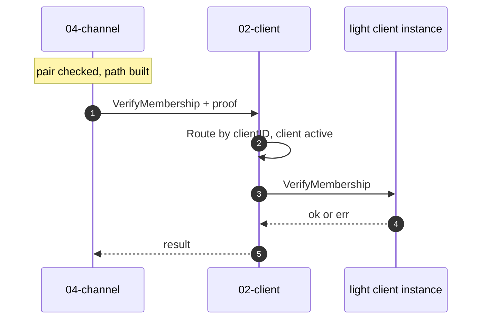
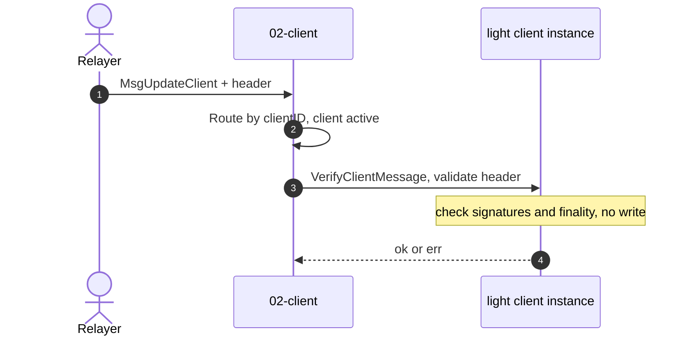

# The Client Registry (`02-client`)

`02-client` **manages the chain's light-client instances**: it creates each client, keeps its store, tracks its counterparty pairing, and routes every call to the right client by ID. It does **not** verify proofs itself, it is a registry and router that delegates verification to the client implementation. So when the channel asks "does this commitment exist in the counterparty's state?", `02-client` resolves the counterparty's client and hands the proof down. For Fast-IBC that client is a CosmWasm contract reached through [the wasm host](04-wasm-host.md), and the real checking, the sync-committee signatures and Merkle proofs, happens inside [the Ethereum light client](05-eth-light-client.md). This is the entry point to the **Client layer** box that [The Channel Layer (04-channel/v2)](02-channel-layer.md) draws in its diagrams.

`02-client` is stock ibc-go v10, unchanged, pinned at v10.3.0 ([`relayer/go.mod`](https://github.com/decentrio/fast-ibc/blob/main/relayer/go.mod)). All ibc-go paths below are that tag.

`02-client` lets many kinds of light client live behind one interface, [`LightClientModule`](https://github.com/cosmos/ibc-go/blob/v10.3.0/modules/core/exported/client.go#L43), whose twelve methods cover a client instance's full lifecycle:

| Stage  | Methods                                                                                   | What it covers                                                           |
| ------ | ----------------------------------------------------------------------------------------- | ------------------------------------------------------------------------ |
| Create | [`Initialize`](https://github.com/cosmos/ibc-go/blob/v10.3.0/modules/core/exported/client.go#L47)                                                                              | Seed the client and its first consensus state                            |
| Update | [`VerifyClientMessage`](https://github.com/cosmos/ibc-go/blob/v10.3.0/modules/core/exported/client.go#L53), [`UpdateState`](https://github.com/cosmos/ibc-go/blob/v10.3.0/modules/core/exported/client.go#L64), [`CheckForMisbehaviour`](https://github.com/cosmos/ibc-go/blob/v10.3.0/modules/core/exported/client.go#L57), [`UpdateStateOnMisbehaviour`](https://github.com/cosmos/ibc-go/blob/v10.3.0/modules/core/exported/client.go#L60) | Validate a new header, advance the tip, or freeze on conflicting headers |
| Verify | [`VerifyMembership`](https://github.com/cosmos/ibc-go/blob/v10.3.0/modules/core/exported/client.go#L68), [`VerifyNonMembership`](https://github.com/cosmos/ibc-go/blob/v10.3.0/modules/core/exported/client.go#L81)                                                 | Prove a key is present, or absent, in the counterparty's state           |
| Query  | [`Status`](https://github.com/cosmos/ibc-go/blob/v10.3.0/modules/core/exported/client.go#L92), [`LatestHeight`](https://github.com/cosmos/ibc-go/blob/v10.3.0/modules/core/exported/client.go#L95), [`TimestampAtHeight`](https://github.com/cosmos/ibc-go/blob/v10.3.0/modules/core/exported/client.go#L98)                                             | Read the client's health, tip, and per-height timestamp                  |
| Admin  | [`RecoverClient`](https://github.com/cosmos/ibc-go/blob/v10.3.0/modules/core/exported/client.go#L106), [`VerifyUpgradeAndUpdateState`](https://github.com/cosmos/ibc-go/blob/v10.3.0/modules/core/exported/client.go#L115)                                            | Governance recovery and chain-upgrade migration                          |

Every call `02-client` handles takes the same shape: [`Route`](https://github.com/cosmos/ibc-go/blob/v10.3.0/modules/core/02-client/keeper/keeper.go#L72) resolves the client's module by ID, parsing the client type out of the ID and rejecting any type not in the chain's allowed-client list, then the keeper confirms the client is **active** and delegates to the client implementation. Nothing above this layer knows whether that client is Tendermint, wasm, or anything else. 

Most commonly used Methods of 02-client:

**Verify** is what the channel calls to prove a packet: [`VerifyMembership`](https://github.com/cosmos/ibc-go/blob/v10.3.0/modules/core/02-client/keeper/keeper.go#L337) on receive or acknowledge, [`VerifyNonMembership`](https://github.com/cosmos/ibc-go/blob/v10.3.0/modules/core/02-client/keeper/keeper.go#L351) on timeout. It runs on every relayed packet (see [Packet flow](02-channel-layer.md#packet-flow)).

**[`VerifyClientMessage`](https://github.com/cosmos/ibc-go/blob/v10.3.0/modules/core/exported/client.go#L53)** is what validates a submitted header. On every update the relayer sends, the light client checks the header is genuine, for the Ethereum client the sync-committee signature and finality proof, and returns ok or error **without writing anything**. Only on success does `02-client` go on to advance the client, or freeze it on conflicting headers. The relayer must call it to advance the client to a height before any packet can be proven at that height, since a proof is checked against the consensus state stored there.

## Client management
### Client identity and storage

Client IDs have the form `{client-type}-{sequence}`, where the sequence is one chain-global counter shared across all types ([`GenerateClientIdentifier`](https://github.com/cosmos/ibc-go/blob/v10.3.0/modules/core/02-client/keeper/keeper.go#L94)). So the first client on a fresh chain, if it is the wasm client, gets `08-wasm-0`.

[`ClientState`](https://github.com/cosmos/ibc-go/blob/v10.3.0/modules/core/exported/client.go#L126) and [`ConsensusState`](https://github.com/cosmos/ibc-go/blob/v10.3.0/modules/core/exported/client.go#L134) are **interfaces**. `02-client` defines neither, it is up to each light client instance to supply its own concrete type (the wasm client's `ClientState`, for example, is `data`/`checksum`/`latest_height`, see [08-wasm](04-wasm-host.md#the-wasm-client-clientstate)). Broadly:

- **`ClientState`** is the client's own configuration and running status: the parameters it validates updates and proofs against, plus its latest height and whether it is frozen. One per client.
- **`ConsensusState`** is a trusted snapshot of the counterparty's consensus at a single height, chiefly the root a proof at that height is checked against. One per height, which is why the client must be updated to a height before anything can be proven at it.

Where each is stored is in [Store](#store).

### Client counterparty

A v1 connection and channel handshake help the two chain establish a trust-worthy communication channel, the handshake steps are verified by two light clients on the two chains. The results in a connection and a channel instance ,registered in the store with all of its underlying setup, a.k.a two the client IDs that backed everything as well as some of the config like channel mode,.... 

V2 drops the connection and channel handshake, as well as the connection/channel instances, leaving just one step: each chain register its light client on the counterparty chain, by linking **the counterparty chain light client** to **its light client on the counterparty chain**. This means recording a [`CounterpartyInfo`](https://github.com/cosmos/ibc-go/blob/v10.3.0/modules/core/02-client/v2/types/counterparty.pb.go#L26) in the counterparty chain client's own store (key `counterparty`, [`SetClientCounterparty`](https://github.com/cosmos/ibc-go/blob/v10.3.0/modules/core/02-client/v2/keeper/keeper.go#L28)):

| Field          | Meaning                                                                                        |
| -------------- | ---------------------------------------------------------------------------------------------- |
| `ClientId`     | the counterparty's client ID for us, the other half of the pair                                |
| `MerklePrefix` | where in the counterparty's state its provable store sits, so a proof knows which path to read |

Registration happens once, through [`MsgRegisterCounterparty`](https://github.com/cosmos/ibc-go/blob/v10.3.0/modules/core/keeper/msg_server.go#L54), callable only by the client's creator and only while no counterparty is set. The same call seeds `NextSequenceSend = 1`, which is what actually **switches on packet flow**. This pairing is v2's entire replacement for the v1 connection and channel handshake: no multi-step handshake, just two one-time registrations. 

The channel enforces this pairing on every packet operation, to make sure it's backed by a correct client pair, before it ever calls the client layer to verify (see [Packet flow](02-channel-layer.md#packet-flow)).

# Implementation Details
## Messages

The core client `Msg` service ([`modules/core/keeper/msg_server.go`](https://github.com/cosmos/ibc-go/blob/v10.3.0/modules/core/keeper/msg_server.go)) handles a client's lifecycle and its pairing. Each message type maps to a handler:

| Message                                                                                                                 | Handler                                                                                                       | Caller         | What it does                                                       |
| ----------------------------------------------------------------------------------------------------------------------- | ------------------------------------------------------------------------------------------------------------- | -------------- | ------------------------------------------------------------------ |
| [`MsgCreateClient`](https://github.com/cosmos/ibc-go/blob/v10.3.0/modules/core/02-client/types/tx.pb.go#L36)            | [`CreateClient`](https://github.com/cosmos/ibc-go/blob/v10.3.0/modules/core/keeper/msg_server.go#L33)         | anyone         | create a client, returning its assigned ID                         |
| [`MsgRegisterCounterparty`](https://github.com/cosmos/ibc-go/blob/v10.3.0/modules/core/02-client/v2/types/tx.pb.go#L33) | [`RegisterCounterparty`](https://github.com/cosmos/ibc-go/blob/v10.3.0/modules/core/keeper/msg_server.go#L54) | client creator | pair it with the counterparty and switch on packet flow            |
| [`MsgUpdateClient`](https://github.com/cosmos/ibc-go/blob/v10.3.0/modules/core/02-client/types/tx.pb.go#L119)           | [`UpdateClient`](https://github.com/cosmos/ibc-go/blob/v10.3.0/modules/core/keeper/msg_server.go#L78)         | relayer        | apply a header, advancing the client, or freeze it on misbehaviour |
| [`MsgRecoverClient`](https://github.com/cosmos/ibc-go/blob/v10.3.0/modules/core/02-client/types/tx.pb.go#L372)          | [`RecoverClient`](https://github.com/cosmos/ibc-go/blob/v10.3.0/modules/core/keeper/msg_server.go#L143)       | governance     | restore an expired or frozen client from an active one             |

Chain-upgrade and param-admin methods (`MsgUpgradeClient`, `MsgIBCSoftwareUpgrade`, `MsgUpdateParams`) also live in this service but are off the packet path.

## Events

`02-client` emits one event per lifecycle action ([`types/events.go`](https://github.com/cosmos/ibc-go/blob/v10.3.0/modules/core/02-client/types/events.go#L23)). Two matter for running Fast-IBC:

| Event | Emitted on | Carries | Why it matters |
| ----- | ---------- | ------- | -------------- |
| `create_client` | `MsgCreateClient` | `client_id`, `client_type` | the operator reads back the assigned client ID, never assume it |
| `update_client` | `MsgUpdateClient` | `client_id`, `consensus_heights` | the relayer sees the client advanced, so proofs at those heights will verify |

The rest (`upgrade_client`, `recover_client`, `client_misbehaviour`, `schedule_ibc_software_upgrade`) fire on governance and misbehaviour actions, off the packet path. Counterparty registration emits no event, it is one-time setup.

## Params

The one gate is [`AllowedClients`](https://github.com/cosmos/ibc-go/blob/v10.3.0/modules/core/02-client/types/params.go#L42): `Route` refuses to resolve a client whose type is not on the list, so verification fails for a disallowed type before it begins. The default is the wildcard [`"*"`](https://github.com/cosmos/ibc-go/blob/v10.3.0/modules/core/02-client/types/keys.go#L37), which permits every type, so a chain that narrows the list **must keep `08-wasm`** on it, or Fast-IBC's Ethereum client cannot run.

## Store

`02-client` keeps everything under a per-client prefix, plus two module-level keys. Most rows are detailed above:

| Key | Value | Notes |
| --- | ----- | ----- |
| `clients/{id}/clientState` | `ClientState` | see [Client identity and storage](#client-identity-and-storage). For a wasm client the value is the wasm `ClientState` (see [08-wasm](04-wasm-host.md#the-wasm-client-clientstate)), wrapping the inner client in `data` |
| `clients/{id}/consensusStates/{height}` | `ConsensusState` | see [Client identity and storage](#client-identity-and-storage) |
| `clients/{id}/counterparty` | [`CounterpartyInfo`](https://github.com/cosmos/ibc-go/blob/v10.3.0/modules/core/02-client/v2/types/keys.go#L14) | see [Client counterparty](#client-counterparty) |
| `clients/{id}/config` | [per-client v2 config](https://github.com/cosmos/ibc-go/blob/v10.3.0/modules/core/02-client/v2/types/keys.go#L19) | optional per-client settings |
| [`nextClientSequence`](https://github.com/cosmos/ibc-go/blob/v10.3.0/modules/core/02-client/types/keys.go#L27) | `uint64` | the chain-global client-ID counter |
| [`clientParams`](https://github.com/cosmos/ibc-go/blob/v10.3.0/modules/core/02-client/types/keys.go#L30) | `Params` | `AllowedClients`, see [Params](#params) |