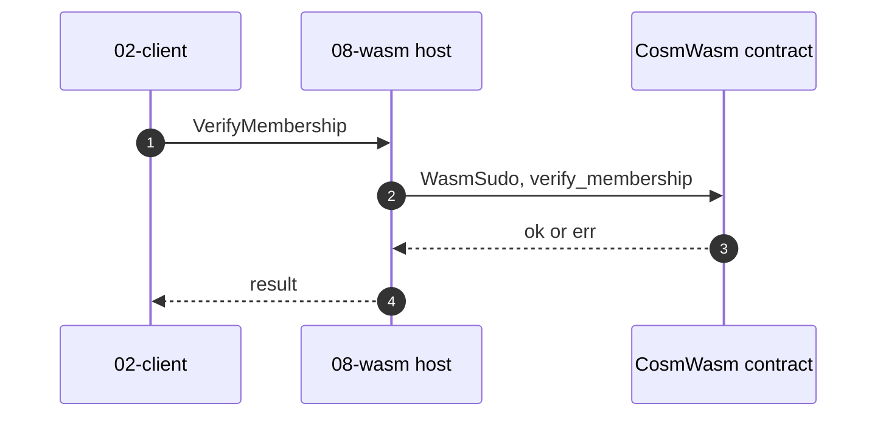
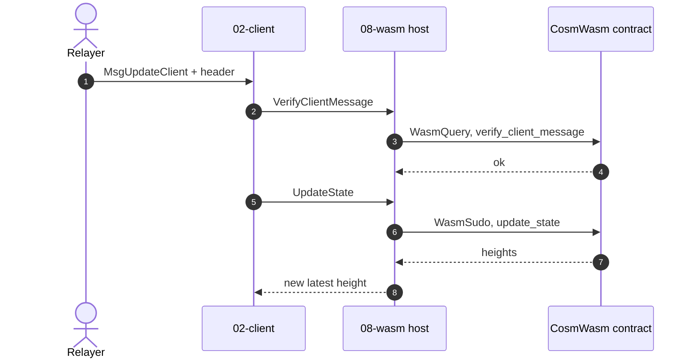

# The Wasm Host (`08-wasm`)

A light client in ibc-go is normally a Go module compiled into the chain binary, so adding or fixing one means forking the binary and coordinating a chain upgrade. `08-wasm` lifts that restriction: a light client can instead be **Wasm bytecode running in a Wasm VM**. The bytecode implements a CosmWasm contract's entry points, and `08-wasm` is a **proxy** that satisfies the [02-client](03-client-registry.md) `LightClientModule` interface by routing each call into the VM for the contract to run ([`light_client_module.go`](https://github.com/cosmos/ibc-go/blob/v10.3.0/modules/light-clients/08-wasm/light_client_module.go)).

Adding a light client is then just a governance proposal that stores the bytecode via `MsgStoreCode` (see [Messages](#messages)), with no coordinated upgrade. Once stored, it is instantiated on a relayer's `MsgCreateClient` like any other client, and the chain treats it from then on as an ordinary `02-client` client with an id like `08-wasm-0`. Fast-IBC's wasm client is [the Ethereum light client](05-eth-light-client.md). `08-wasm` is stock ibc-go v10, its own Go module, pinned at v10.3.0 ([`relayer/go.mod`](https://github.com/decentrio/fast-ibc/blob/main/relayer/go.mod)).

This doc covers what a wasm client's **state** looks like (`ClientState` and `ConsensusState`) and how the host **proxies** the contract, then the reference sections under [Implementation Details](#implementation-details).

## The wasm client `ClientState`

Its [`ClientState`](https://github.com/cosmos/ibc-go/blob/v10.3.0/modules/light-clients/08-wasm/types/wasm.pb.go#L28) is just three fields:

| Field | Meaning |
| ----- | ------- |
| `data` | The inner client's own state, opaque to the host |
| `checksum` | Which stored code runs this client |
| `latest_height` | The height the client has advanced to |

The host never interprets `data`. It passes it to the contract and stores back whatever the contract returns, so a new client type needs no host changes at all. The wasm client [`ConsensusState`](https://github.com/cosmos/ibc-go/blob/v10.3.0/modules/light-clients/08-wasm/types/wasm.pb.go#L70) is simpler still, a single `data` field wrapping the inner client's consensus state, likewise opaque.

## Proxying the contract

A CosmWasm contract qualifies as a wasm client by implementing four entry points: `instantiate` (seeded with `InstantiateMessage { client_state, consensus_state, checksum }`), `query`, `sudo`, and `migrate` for recovery and upgrades. `execute` is unused. These cover almost the whole `LightClientModule` interface: `instantiate` creates the client, and the `QueryMsg` and `SudoMsg` variants that `query` and `sudo` handle ([`contract_api.go`](https://github.com/cosmos/ibc-go/blob/v10.3.0/modules/light-clients/08-wasm/types/contract_api.go)) cover the rest. The only method left out is `LatestHeight`, which the host reads directly from the `ClientState` rather than calling the contract.

**`QueryMsg`** is the read-only half, dispatched with `WasmQuery`:

| Variant | What it does |
| ------- | ------------ |
| `status` | reports whether the client is active, frozen, or expired (`StatusResult`) |
| `timestamp_at_height` | returns the timestamp of the consensus state stored at a height |
| `verify_client_message` | validates a submitted header or misbehaviour, writing nothing |
| `check_for_misbehaviour` | reports whether a client message is conflicting (`CheckForMisbehaviourResult{found_misbehaviour}`) |

**`SudoMsg`** is the privileged, may-write half, dispatched with `WasmSudo`:

| Variant                           | What it does                                                                                          |
| --------------------------------- | ----------------------------------------------------------------------------------------------------- |
| `update_state`                    | applies a validated header and writes the new consensus state, returning `UpdateStateResult{heights}` |
| `update_state_on_misbehaviour`    | freezes the client                                                                                    |
| `verify_membership`               | proves a key is present in the counterparty's state                                                   |
| `verify_non_membership`           | proves a key is absent                                                                                |
| `verify_upgrade_and_update_state` | verifies a chain upgrade and updates the client to it                                                 |
| `migrate_client_store`            | verifies a substitute client and migrates to its state                                                |

The **contract** performs the writes, not the host: on a `SudoMsg` the host hands it a mutable handle to the client's store and it writes the new state there directly, while a `QueryMsg` handle is read-only. The host provides the store and invokes the contract, but never writes the client's state itself.

So a packet proof, where [02-client](03-client-registry.md) routes into this host, ends in a `WasmSudo` carrying `verify_membership` ([`VerifyMembership`](https://github.com/cosmos/ibc-go/blob/v10.3.0/modules/light-clients/08-wasm/light_client_module.go#L204)):

A header update instead runs **both** envelopes in turn: a read-only [`verify_client_message`](https://github.com/cosmos/ibc-go/blob/v10.3.0/modules/light-clients/08-wasm/light_client_module.go#L81) query that does the checking, then an [`update_state`](https://github.com/cosmos/ibc-go/blob/v10.3.0/modules/light-clients/08-wasm/light_client_module.go#L164) sudo that writes the new height.

Two details are worth flagging. The two membership checks sit under `SudoMsg` even though they only read, so verification runs through the privileged path. And `VerifyMembership` first requires the client's `latest_height` to be at or above the proof height, which is the code-level reason a relayer must update the client before it can prove anything against it.

# Implementation Details
## Messages

The `08-wasm` `Msg` service ([`keeper/msg_server.go`](https://github.com/cosmos/ibc-go/blob/v10.3.0/modules/light-clients/08-wasm/keeper/msg_server.go)) governs the contract bytecode, every method authority-gated to governance. Stored code is addressed by its **SHA-256 checksum**, so a client is pinned to the exact bytecode that runs it.

| Message | Handler | What it does |
| ------- | ------- | ------------ |
| [`MsgStoreCode`](https://github.com/cosmos/ibc-go/blob/v10.3.0/modules/light-clients/08-wasm/types/tx.pb.go#L32) | [`StoreCode`](https://github.com/cosmos/ibc-go/blob/v10.3.0/modules/light-clients/08-wasm/keeper/msg_server.go#L18) | upload client bytecode, addressed by its checksum |
| [`MsgMigrateContract`](https://github.com/cosmos/ibc-go/blob/v10.3.0/modules/light-clients/08-wasm/types/tx.pb.go#L225) | [`MigrateContract`](https://github.com/cosmos/ibc-go/blob/v10.3.0/modules/light-clients/08-wasm/keeper/msg_server.go#L64) | migrate a client to different stored code |
| [`MsgRemoveChecksum`](https://github.com/cosmos/ibc-go/blob/v10.3.0/modules/light-clients/08-wasm/types/tx.pb.go#L133) | [`RemoveChecksum`](https://github.com/cosmos/ibc-go/blob/v10.3.0/modules/light-clients/08-wasm/keeper/msg_server.go#L37) | remove uploaded bytecode from the allowed set |

## Events

`08-wasm` emits one event per governance action ([`types/events.go`](https://github.com/cosmos/ibc-go/blob/v10.3.0/modules/light-clients/08-wasm/types/events.go)):

| Event | Emitted on | Carries |
| ----- | ---------- | ------- |
| `store_wasm_code` | `MsgStoreCode` | the stored `wasm_checksum` |
| `migrate_contract` | `MsgMigrateContract` | the `client_id` and its `new_checksum` |

Both fire on governance operations, off the packet path.

## Params

`08-wasm` has **no module parameters** of its own. Whether a wasm client can be used at all is gated by `AllowedClients` at the client layer, which must include `08-wasm` (see [02-client](03-client-registry.md#params)).

## Store

`08-wasm` stores the uploaded contract bytecode, addressed by its SHA-256 checksum, and the set of known checksums ([`ChecksumsKey`](https://github.com/cosmos/ibc-go/blob/v10.3.0/modules/light-clients/08-wasm/types/keys.go#L21)). A wasm client's own state is not kept here: its `ClientState` and per-height `ConsensusState` live in the [02-client per-client store](03-client-registry.md#client-identity-and-storage), the `ClientState` value being the wasm `ClientState` above, wrapping the inner client in `data`.

## Clients hosted here

| Client | Code | Status |
| ------ | ---- | ------ |
| Ethereum | [`programs/cw-ics08-wasm-eth`](https://github.com/decentrio/fast-ibc/blob/main/programs/cw-ics08-wasm-eth) | Production, see [the next doc](05-eth-light-client.md) |
| Arbitrum, Base, OP | `programs/cw-ics08-wasm-{arbitrum,base,op}` | Checksum-distinct artifacts, one lifecycle. **Devnet only**, they trust any submitter ([`docs/L2_CLIENTS.md`](https://github.com/decentrio/fast-ibc/blob/main/docs/L2_CLIENTS.md)) |

The Ethereum contract implements `instantiate`, all four query variants, and four sudo variants: `verify_membership`, `verify_non_membership`, `update_state`, and `update_state_on_misbehaviour`. The upgrade and migrate-store paths are left unimplemented. What runs inside those handlers, the sync-committee signature check and the Merkle-proof verification, is [the next doc](05-eth-light-client.md).

Bringing up a Fast-IBC client is exactly the message sequence across both modules: governance `MsgStoreCode` the Ethereum contract, then `MsgCreateClient` and `MsgRegisterCounterparty` (see [02-client](03-client-registry.md#messages)), and the relayer keeps it live with `MsgUpdateClient`.