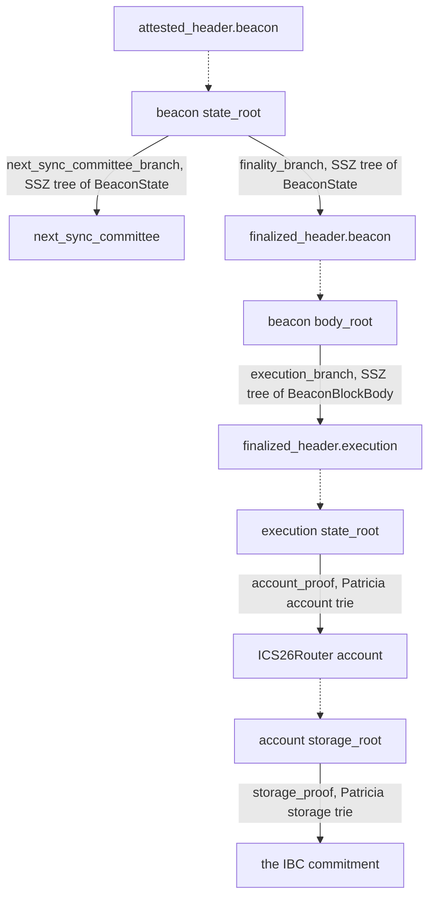
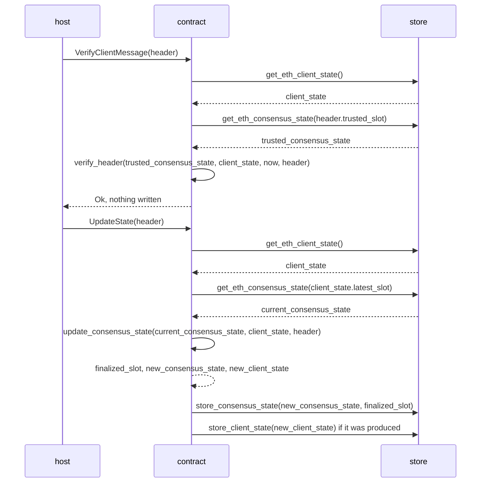
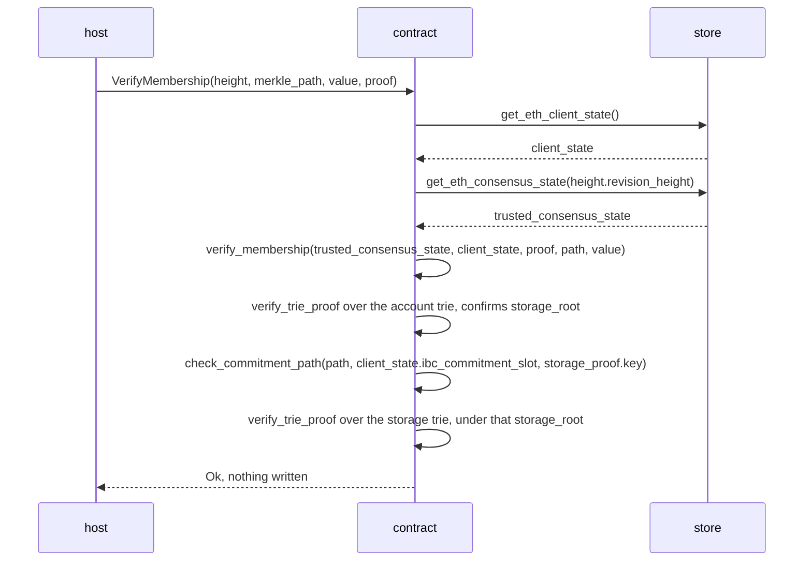
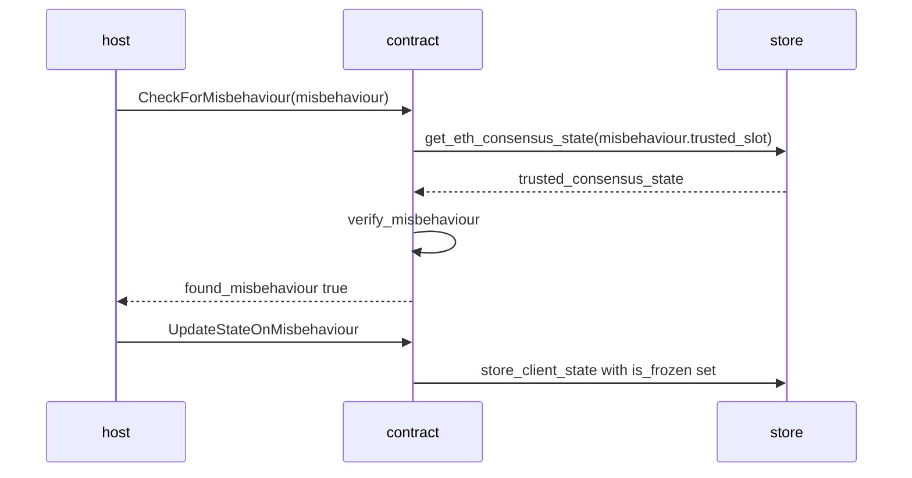

# The Ethereum Light Client (`cw-ics08-wasm-eth`)

The Ethereum light client lets a Cosmos chain **verify IBC packet commitments written on Ethereum**. It is a CosmWasm contract, wrapped by [08-wasm](04-wasm-host.md) into an IBC light client, so the host calls it through the same entry points as any other client.

What it does not do is verify Ethereum consensus. It follows the **sync committee** instead.

# Context

## Ethereum sync committee

### Definition

Verifying Ethereum consensus would mean checking signatures from the full validator set, which is far too heavy to run on-chain. The sync committee exists so that a light client does not have to.

Ethereum samples **512 validators** into a committee, which then attests to blocks for one **sync committee period**, 256 epochs or roughly 27 hours. Because that set is small and fixed for the whole period, a client holding those 512 keys can verify their attestations on its own.

### Mechanism as a light client

#### Data types

Verifying an attestation means working with six things: the header being attested to, the hashing scheme that makes its contents provable, the wrapper that adds the execution header, the message a verifier receives, the committee that signs, and the signature it produces.

##### Beacon header

The committee signs a [`BeaconBlockHeader`](https://github.com/ethereum/consensus-specs/blob/v1.5.0/specs/phase0/beacon-chain.md#beaconblockheader), Ethereum's consensus-layer block header, and every value the light client checks is proven against it.

| Field | Type | Description |
| --- | --- | --- |
| `slot` | `Slot` | When the block was proposed |
| `proposer_index` | `ValidatorIndex` | Which validator proposed it |
| `parent_root` | `Root` | SSZ root of the previous header |
| `state_root` | `Root` | SSZ root of `BeaconState`, the whole consensus state at that slot |
| `body_root` | `Root` | SSZ root of `BeaconBlockBody`, the block's contents |

Three of those fields are roots, each a single 32-byte hash standing in for a much larger structure. Two of them are what every later proof is checked against, and they commit to different structures. `state_root` commits to `BeaconState`, the consensus state, which holds finality and the sync committees. `body_root` commits to `BeaconBlockBody`, the block's contents, which include the execution payload.

##### SSZ

Those roots come from [SimpleSerialize](https://github.com/ethereum/consensus-specs/blob/v1.5.0/ssz/simple-serialize.md), the consensus layer's serialization and merkleization scheme. Its [Merkleization](https://github.com/ethereum/consensus-specs/blob/v1.5.0/ssz/simple-serialize.md#merkleization) section defines `hash_tree_root`, which reduces any container to 32 bytes, so that `state_root` is `hash_tree_root(BeaconState)` and `body_root` is `hash_tree_root(BeaconBlockBody)`.

Any single field can then be proven against either root with a **Merkle branch**, so the client verifies one field without ever holding the structure it came from, the verification function is denoted by `verify_ssz_branch()`
##### Light client header
`LightClientHeader` wraps a `BeaconBlockHeader` alongside an `ExecutionPayloadHeader`. IBC commitments live in the `ICS26Router` contract's storage, and the execution header carries the execution `state_root`, which commits to the `ICS26Router` account. Since the payload sits inside the block body, `execution_branch` is the SSZ Merkle branch proving `ExecutionPayloadHeader` against `beacon.body_root`.

| Field              | Type                                                   | Description                                                     |
| ------------------ | ------------------------------------------------------ | --------------------------------------------------------------- |
| `beacon`           | `BeaconBlockHeader`                                    | The consensus header, and the object the committee signs        |
| `execution`        | `ExecutionPayloadHeader`                               | The execution-layer header, carrying the execution `state_root` |
| `execution_branch` | `Vector[Bytes32, floorlog2(EXECUTION_PAYLOAD_GINDEX)]` | Proves `execution` against `beacon.body_root`                   |
`ExecutionPayloadHeader.state_root` is a different kind of root from `BeaconBlockHeader.state_root`, despite the shared name. The beacon field is an SSZ root over consensus state. This one is the root of Ethereum's [Merkle-Patricia trie](https://ethereum.org/en/developers/docs/data-structures-and-encoding/patricia-merkle-trie/), the execution layer's own structure, and it is what IBC commitment proofs are checked against.

##### Light client update

[`LightClientUpdate`](https://github.com/ethereum/consensus-specs/blob/v1.5.0/specs/altair/light-client/sync-protocol.md#lightclientupdate) is the message a light client receives. Its seven fields:

| Field                        | Type                                                     | Description                                                                                                           |
| ---------------------------- | -------------------------------------------------------- | --------------------------------------------------------------------------------------------------------------------- |
| `attested_header`            | `LightClientHeader`                                      | The signed object. `finality_branch` and `next_sync_committee_branch` are both proven against its beacon `state_root` |
| `sync_aggregate`             | `SyncAggregate`                                          | Names who signed, and carries the signature to verify                                                                 |
| `signature_slot`             | `Slot`                                                   | Orders the slots, selects which committee signed, and selects the fork version for the signing domain                 |
| `finalized_header`           | `LightClientHeader`                                      | Carries the execution `state_root` the client stores and later checks IBC commitment proofs against                   |
| `finality_branch`            | `Vector[Bytes32, floorlog2(FINALIZED_ROOT_GINDEX)]`      | Proves `finalized_header` against the attested beacon `state_root`                                                    |
| `next_sync_committee`        | `SyncCommittee`                                          | The following period's keys, optional in general, required on an update that crosses a period                         |
| `next_sync_committee_branch` | `Vector[Bytes32, floorlog2(NEXT_SYNC_COMMITTEE_GINDEX)]` | Proves `next_sync_committee` against the attested beacon `state_root`                                                 |

The seven fields do three jobs. `attested_header`, `sync_aggregate` and `signature_slot` prove that a known committee signed one specific header, and `attested_header` is the only signed object in the message. `finalized_header` and `finality_branch` add an older header that nobody signed, which the client accepts because the branch shows it committed inside the signed header's beacon `state_root`. `next_sync_committee` and its branch add the following period's committee, also unsigned and also accepted through a branch, and without them the client could not verify any update once the current period ends.

Every other field exists to establish one value, `finalized_header.execution.state_root`, which the client stores and later checks IBC commitment proofs against.

##### Sync committee

[`SyncCommittee`](https://github.com/ethereum/consensus-specs/blob/v1.5.0/specs/altair/beacon-chain.md#synccommittee) holds the keys an update is checked against, so a client must already have one before it can verify a header at all.

| Field | Type | Description |
| --- | --- | --- |
| `pubkeys` | `Vector[BLSPubkey, 512]` | One public key per member, in committee order |
| `aggregate_pubkey` | `BLSPubkey` | Their sum, precomputed by Ethereum |

Members sign with [BLS12-381](https://github.com/ethereum/consensus-specs/blob/v1.5.0/specs/phase0/beacon-chain.md#bls-signatures), the scheme the consensus layer uses throughout. Public keys are 48-byte compressed G1 points and signatures are 96-byte G2 points, so a full committee is 512 x 48 = 24,576 bytes.

`pubkeys` is a vector rather than a set, and the order is fixed for the whole period. Member `i` stays at `pubkeys[i]`, which is what lets a signature identify its signers by position instead of mapping via their keys.

##### Sync aggregate

[`SyncAggregate`](https://github.com/ethereum/consensus-specs/blob/v1.5.0/specs/altair/beacon-chain.md#syncaggregate) is the committee's attestation to a header, and the only signature a light client verifies. It arrives as the `sync_aggregate` field of a `LightClientUpdate`.

| Field                      | Type             | Description                                                  |
| -------------------------- | ---------------- | ------------------------------------------------------------ |
| `sync_committee_bits`      | `Bitvector[512]` | One bit per member, marking who signed, so 64 bytes          |
| `sync_committee_signature` | `BLSSignature`   | One signature, aggregated over every member whose bit is set |

Bit `i` marks whether member `pubkeys[i]` signed. The client reads the bits and the keys in the same order, keeps the keys whose bit is set, and aggregates those into the public key it checks the signature against.

The bits also give a count of how many members signed. That count is the input to the finality threshold, which decides whether an update is accepted.
#### Verification Logic

A header verification starts with basic validation, then goes through two stages: signature verification and the finality threshold check. After the header is verified, the client executes data verification based on that header, so that the data can be used for client maintaining and packet verification.

##### Basic validation

Before any signature is checked, the update has to be structurally sound and admissible against what the client already stores. `active` is the  committee the header declared.

```ruby
basic_validation(client_state, trusted_consensus_state, active, update, current_slot)

    # both headers well formed: execution proven against its own body_root
    for lc_header in update.attested_header, update.finalized_header
        verify_ssz_branch(
            root   = lc_header.beacon.body_root,
            gindex = EXECUTION_PAYLOAD_GINDEX,
            leaf   = hash_tree_root(lc_header.execution),
            branch = lc_header.execution_branch)

    # slots ordered, and the update not from the future
    require update.finalized_header.beacon.slot != client_state.genesis_slot
    require current_slot >= update.signature_slot
    require update.signature_slot > update.attested_header.beacon.slot
                                 >= update.finalized_header.beacon.slot

    stored_period    := client_state.compute_sync_committee_period_at_slot(
                            trusted_consensus_state.slot)
    signature_period := client_state.compute_sync_committee_period_at_slot(
                            update.signature_slot)
    attested_period  := client_state.compute_sync_committee_period_at_slot(
                            update.attested_header.beacon.slot)
    finalized_period := client_state.compute_sync_committee_period_at_slot(
                            update.finalized_header.beacon.slot)

    # the signing committee must be one the client can already name
    if active is Next
        require signature_period == stored_period or stored_period + 1
    else
        require signature_period == stored_period

    # relevant: a newer attested header, or the next committee the client lacks
    require update.attested_header.beacon.slot > trusted_consensus_state.slot
            or (active is not Next
                and update.next_sync_committee_branch is set
                and attested_period == stored_period)

    # the finalized header must be newer than the one already stored
    require update.finalized_header.beacon.slot > trusted_consensus_state.slot

    # crossing into a new period requires the next committee
    if finalized_period > stored_period
        require update.next_sync_committee_branch is set

    return stored_period, signature_period, attested_period
```

##### Signature verification

The client already holds the `SyncCommittee`, so it can check the `SyncAggregate` signature over the `attested_header`. The signed message is not the `attested_header` itself but its signing root.

```ruby
signing_root = hash_tree_root(SigningData{
  object_root: hash_tree_root(attested_header.beacon),
  domain:      compute_domain(DOMAIN_SYNC_COMMITTEE, fork_version,
                              genesis_validators_root)
})
```

[`compute_domain`](https://github.com/ethereum/consensus-specs/blob/v1.5.0/specs/phase0/beacon-chain.md#compute_domain) mixes in the fork version and `genesis_validators_root`, which is what stops a signature being replayed onto another fork or another chain. The fork version is read at the epoch of `signature_slot - 1`, since the committee signs the block root of the slot before it.

With the message fixed, the client reads `sync_committee_bits` to find which members signed, aggregates those public keys, and verifies the signature against the result. In the signature verification, two inputs come from what the client already holds, `genesis_validators_root` and `SyncCommittee.pubkeys`. The rest arrive in the update: `attested_header`, `signature_slot`, `sync_committee_bits` and `sync_committee_signature`.

```ruby
verify_signature(client_state, active, update, stored_period, signature_period)

    aggregate := update.sync_aggregate

    # the declared committee must match the period the signature was made in
    require active is Current if signature_period == stored_period, else Next
    require aggregate.sync_committee_size() == len(active.pubkeys)

    participants := active.pubkeys selected by aggregate.sync_committee_bits
    fork_version := the fork version at the epoch of update.signature_slot - 1
    domain       := compute_domain(DOMAIN_SYNC_COMMITTEE, fork_version,
                                   client_state.genesis_validators_root)
    signing_root := compute_signing_root(update.attested_header.beacon, domain)

    fast_aggregate_verify(participants, signing_root,
                          aggregate.sync_committee_signature)
```
##### Finality threshold

A committee of 512 will always contain a few offline or dishonest members, so the count matters as much as the cryptography. The spec accepts an update only when [two thirds participated](https://github.com/ethereum/consensus-specs/blob/v1.5.0/specs/altair/light-client/sync-protocol.md#process_light_client_update):

```ruby
verify_finality_threshold(update)
    bits := update.sync_aggregate.sync_committee_bits
    require get_set_bit_count(bits) * 3 >= len(bits) * 2
```

On mainnet that is **342 of 512**. Below it, the client refuses the update rather than advancing on weak support.

##### Data verification

The two checks above establish `attested_header.beacon` as trusted, so its `state_root` becomes a root the client can prove further data against, using the branches, as per [SSZ](#ssz). 



How to read this diagram:
- Dotted edges point from a struct to its field 
- Solid edges point from the root of a tree to its leaf.

Four trees appear in that chain, and every root after the first is a field of a container the tree above it proved. The scheme changes at `execution state_root`, whose value is a Patricia root, which is why [Verify membership and non-membership](#verify-membership-and-non-membership) walks tries instead of following branches.

These types of data is verified in the light client [Update client](#update-client) logic:
###### Execution state_root
Since the IBC commitment is used included in the Ethereum Patricia tree whose root is `execution state_root` as shown above. The client need to constantly update the `execution state_root` for every block that has new IBC commitment. It does so via the verification chain of: `beacon state_root` -> `finalized_header.beacon` -> `finalized_header.execution`, using SSZ scheme.
###### Next sync committee
Ethereum rotates the sync committee once per period. At the start of a new period, it promotes the next committee to current and computes a fresh next one with [`get_next_sync_committee`](https://github.com/ethereum/consensus-specs/blob/v1.5.0/specs/altair/beacon-chain.md#get_next_sync_committee). From that point on, `attested_header.beacon` will be signed by the new sync committee.

A client typically holds two records of `sync_committee` : the `current_sync_committee` and the `next_sync_committee`. The `current_sync_committee` is the committee whose signature shale be verified for header of the current period, the `next_sync_committee` is the new `current_sync_committee` for the next period. Any [Update client](#update-client) that crosses from period `n` to period `n+1` will set the client `current_sync_committee`  old `next_sync_committee` to be the new `current_sync_committee` and set the client `next_sync_committee` to be the [Light client update](#light-client-update)`.next_sync_committee`.

```ruby
verify_data(client_state, active, update, stored_period, attested_period)

    # both branches are proven against the one root the signature made trusted
    attested_root := update.attested_header.beacon.state_root
    attested_slot := update.attested_header.beacon.slot

    # the finalized header
    verify_ssz_branch(
        root   = attested_root,
        gindex = finalized_root_gindex_at_slot(client_state, attested_slot),
        leaf   = hash_tree_root(update.finalized_header.beacon),
        branch = update.finality_branch)

    # the next sync committee, only when the update carries one
    if update.next_sync_committee_branch is set
        if attested_period == stored_period and active is Next
            require update.next_sync_committee == active
        verify_ssz_branch(
            root   = attested_root,
            gindex = next_sync_committee_gindex_at_slot(client_state, attested_slot),
            leaf   = hash_tree_root(update.next_sync_committee),
            branch = update.next_sync_committee_branch)
    else
        require update.next_sync_committee is not set
```

## Implementation as a CosmWasm client

### State

The contract keeps two records. `ClientState` holds the configuration needed to interpret Ethereum plus `latest_slot` and `latest_execution_block_number`, and one `ConsensusState` per finalized slot holds a header the client has already verified.

The contract wraps both in the 08-wasm envelope before storing them under its own prefix, so what sits on disk is a protobuf `Any` holding the Ethereum-specific JSON in its `data` field. The host reads the envelope but never that JSON.

#### `ClientState`

Fifteen fields, all initialised at creation and read by every entry point except `timestamp_at_height`. Twelve are configuration that only a migration changes. The other three, `latest_slot`, `latest_execution_block_number` and `is_frozen`, are rewritten as the client runs.

| Field                              | Type             | Description                                                                                          |
| ---------------------------------- | ---------------- | ---------------------------------------------------------------------------------------------------- |
| `chain_id`                         | `u64`            | Identifies the Ethereum chain, read by no check                                                      |
| `genesis_validators_root`          | `B256`           | Builds the signing domain, see [Signature verification](#signature-verification)                                           |
| `min_sync_committee_participants`  | `u64`            | The floor on signers for a structurally valid update, below the [Finality threshold](#finality-threshold)              |
| `sync_committee_size`              | `u64`            | The exact key count a supplied [Sync committee](#sync-committee) must have                                         |
| `genesis_time`                     | `u64`            | Converts host block time to a slot                                                                   |
| `genesis_slot`                     | `u64`            | The slot that time conversion starts from                                                            |
| `fork_parameters`                  | `ForkParameters` | Selects the [Light client header](#light-client-header) layout and the fork version used in [Signature verification](#signature-verification) |
| `seconds_per_slot`                 | `u64`            | Converts host block time to a slot                                                                   |
| `slots_per_epoch`                  | `u64`            | Period arithmetic                                                                                    |
| `epochs_per_sync_committee_period` | `u64`            | Period arithmetic                                                                                    |
| `latest_slot`                      | `u64`            | The newest finalized slot the client has stored                                                      |
| `latest_execution_block_number`    | `u64`            | Tells the relayer which Ethereum block to build proofs at                                            |
| `is_frozen`                        | `bool`           | Makes the client report `Frozen` after proven misbehaviour                                           |
| `ibc_contract_address`             | `Address`        | The `ICS26Router` account a commitment proof is checked against                                      |
| `ibc_commitment_slot`              | `U256`           | The storage slot of the commitments mapping                                                          |

Stored under the key `clientState`. It is written at instantiate, by `update_state` when `finalized_slot` exceeds `latest_slot`, by the misbehaviour entry point, which changes `is_frozen` alone, and by a migration.

The protocol constants sit here rather than in the contract's code, which is what lets one uploaded contract follow a devnet with a different committee size or slot schedule. Instantiate validates almost none of them, so a wrong value surfaces at the first header rather than at creation.

#### `ConsensusState`

Five fields, one record per finalized beacon slot.

| Field                    | Type            | Description                                                                                                     |
| ------------------------ | --------------- | --------------------------------------------------------------------------------------------------------------- |
| `slot`                   | `u64`           | The finalized [Beacon header](#beacon-header) slot, and the key this record is stored under                                  |
| `state_root`             | `B256`          | The execution `state_root` from the finalized [Light client header](#light-client-header), which packet proofs are checked against |
| `timestamp`              | `u64`           | The finalized execution timestamp, answering IBC time queries                                                   |
| `current_sync_committee` | `SyncCommittee` | The [Sync committee](#sync-committee) trusted at this slot                                                                    |
| `next_sync_committee`    | `SyncCommittee` | The following period's committee, absent until a [Light client update](#light-client-update) proves it                             |

Stored under `consensusStates/0-{slot}`, written at instantiate and by every `update_state`. The contract doesn't overwrite records, so they accumulate as the client advances.

Neither committee field holds the 512 keys themselves. A full committee is 512 x 48 = 24,576 bytes, so the contract keeps only `pubkeys.tree_hash_root()` and `aggregate_pubkey`. Every update ships the full list, and the contract recomputes both values to check it against the record.

#### Other configuration

There are no module parameters. Every threshold and constant the contract uses is a `ClientState` field fixed at creation, changeable only by a governance migration.

Two settings live outside the contract entirely. The host decides which client types are permitted and which wasm checksums may run, and the contract's own version is recorded under `contract_info` by cw2.

### Logic 

#### Core logic

Two operations do the verifying. [Update client](#update-client) turns a [Light client update](#light-client-update) into a stored `ConsensusState` ([State](#state)), and [Verify membership and non-membership](#verify-membership-and-non-membership) uses the execution `state_root` to verify IBC packet commitments. Everything else is lifecycle and reads: creating the client, freezing it on proven misbehaviour, migrating it, and answering queries.

##### Update client

The host applies an update in two calls. `VerifyClientMessage` checks the header and writes nothing, `UpdateState` stores the result. 




[`verify_header`](https://github.com/decentrio/fast-ibc/blob/be3107f/packages/ethereum/light-client/src/verify.rs#L51) handles the [Verification Logic](#verification-logic), verifying the `header` as per the sync committee spec. It executes that logic against a trusted consensus state verified and stored previously. Any update that crosses into a new period must also [set the next_sync_committee](#next-sync-committee).

```ruby
verify_header(trusted_consensus_state, client_state, now, header)
    update := header.consensus_update

    # the committee the header declares must be one the client already trusts
    active := header.active_sync_committee   # Current or Next, never both
    if active is Current
        require active == trusted_consensus_state.current_sync_committee
    if active is Next
        require trusted_consensus_state.next_sync_committee is set
                else NextSyncCommitteeUnknown
        require active == trusted_consensus_state.next_sync_committee
    require len(active.pubkeys) == client_state.sync_committee_size

    current_slot := client_state.compute_slot_at_timestamp(now)

    stored_period, signature_period, attested_period
        := basic_validation(client_state, trusted_consensus_state,
                            active, update, current_slot)

    verify_signature(client_state, active, update, stored_period, signature_period)
    verify_finality_threshold(update)
    verify_data(client_state, active, update, stored_period, attested_period)
```

[`update_consensus_state`](https://github.com/decentrio/fast-ibc/blob/be3107f/packages/ethereum/light-client/src/update.rs#L19) then writes the verified `header` into the client's [ClientState](#clientstate) and [ConsensusState](#consensusstate). 

```ruby
update_consensus_state(current_consensus_state, client_state, header)
    returns (slot, ConsensusState, ClientState or nothing)

    update := header.consensus_update

    # the ClientState and the record it points at must agree
    require client_state.latest_slot == current_consensus_state.slot

    stored_period    := client_state.compute_sync_committee_period_at_slot(
                            current_consensus_state.slot)
    finalized_slot   := update.finalized_header.beacon.slot
    finalized_period := client_state.compute_sync_committee_period_at_slot(
                            finalized_slot)

    new := copy(current_consensus_state)      # both committees carried over

    if current_consensus_state.next_sync_committee is set
        if finalized_period == stored_period + 1   # crossing the boundary
            new.current_sync_committee := current_consensus_state.next_sync_committee
            new.next_sync_committee    := update.next_sync_committee
        else
            # still the same period, neither committee field is assigned
    else                                                 # nothing to cross with
        require finalized_period == stored_period
        new.next_sync_committee := update.next_sync_committee

    new.slot       := finalized_slot
    new.state_root := update.finalized_header.execution.state_root
    new.timestamp  := update.finalized_header.execution.timestamp

    new_client_state := client_state with
                            latest_slot                   = finalized_slot
                            latest_execution_block_number =
                                update.finalized_header.execution.block_number
                        produced only if
                            finalized_slot > current_consensus_state.slot

    return (finalized_slot, new, new_client_state)
```

##### Verify membership and non-membership

An Ethereum contract's storage is a map from 32-byte keys to 32-byte values, and an IBC commitment occupies one entry of that map in the `ICS26Router` contract. Its key comes from the packet path and `ibc_commitment_slot` ([State](#state)). `VerifyMembership` and `VerifyNonMembership` check that slot against the execution `state_root` of a stored `consensus_state`. `VerifyMembership` proves it holds a given value, `VerifyNonMembership` proves the key is absent.



```ruby
VerifyMembership(height, merkle_path, value, proof)     # read-only
    client_state            := get_eth_client_state()
    trusted_consensus_state := get_eth_consensus_state(height.revision_height)
    verify_membership(trusted_consensus_state, client_state,
                      proof, merkle_path.key_path, value)
```

[`verify_membership`](https://github.com/decentrio/fast-ibc/blob/be3107f/packages/ethereum/light-client/src/membership.rs#L26) is the function that entry point calls. [`verify_non_membership`](https://github.com/decentrio/fast-ibc/blob/be3107f/packages/ethereum/light-client/src/membership.rs#L76) is the same walk, differing in two lines.

```ruby
verify_membership(trusted_consensus_state, client_state, proof, path, raw_value)
    account_proof, storage_proof := MembershipProof decoded from proof

    # 1. account trie, confirming the storage_root the relayer claims
    verify_trie_proof(
        root  = trusted_consensus_state.state_root,
        key   = client_state.ibc_contract_address,
        value = an account whose storage_root == account_proof.storage_root,
        proof = account_proof.proof)

    # 2. the storage key is derived from the path, never taken from the relayer
    require len(path) == 1
    require storage_proof.key
            == keccak256( keccak256(path[0]) || client_state.ibc_commitment_slot )

    # 3. the value sitting at that key is the one the caller asked about
    require storage_proof.value as bytes == raw_value

    # 4. storage trie, under the root step 1 confirmed
    verify_trie_proof(
        root  = account_proof.storage_root,
        key   = storage_proof.key,
        value = rlp_encode(storage_proof.value),
        proof = storage_proof.proof)

verify_non_membership(trusted_consensus_state, client_state, proof, path)
    account_proof, storage_proof := MembershipProof decoded from proof
    steps 1 and 2 as above, then

    require storage_proof.value is zero
    verify_trie_proof(
        root  = account_proof.storage_root,
        key   = storage_proof.key,
        value = nothing,                  # absence, not a value
        proof = storage_proof.proof)
```

`verify_trie_proof` is the Patricia counterpart of the `verify_ssz_branch` in [SSZ](#ssz), one primitive used three times. In the code it is three functions, `verify_account_storage_root` for the account verification, and `verify_storage_inclusion_proof` and `verify_storage_exclusion_proof` for the two storage verification inside the account.


#### Client methods

The contract exposes five CosmWasm entry points, and every call from ibc-go arrives through one of them. 02-client invokes a `ClientState` method, [08-wasm](04-wasm-host.md) encodes it as an `InstantiateMsg`, `SudoMsg`, `QueryMsg` or `MigrateMsg`, and [`contract.rs`](https://github.com/decentrio/fast-ibc/blob/be3107f/programs/cw-ics08-wasm-eth/src/contract.rs) dispatches on the variant. Mutability decides which entry point carries a given call: `query` is handed a read-only `Deps`, `sudo` a `DepsMut`, so a check that writes nothing is a query and a state transition is a sudo.

| Entry point   | Message                       | What it does                                                                                                |
| ------------- | ----------------------------- | ----------------------------------------------------------------------------------------------------------- |
| `instantiate` | [`InstantiateMsg`](https://github.com/decentrio/fast-ibc/blob/be3107f/programs/cw-ics08-wasm-eth/src/instantiate.rs#L27)              | Writes the first `ClientState` and `ConsensusState`, and records the contract version under `contract_info` |
| `sudo`        | [`UpdateState`](https://github.com/decentrio/fast-ibc/blob/be3107f/programs/cw-ics08-wasm-eth/src/sudo.rs#L92)                 | The write half of [Update client](#update-client)                                                                        |
| `sudo`        | [`UpdateStateOnMisbehaviour`](https://github.com/decentrio/fast-ibc/blob/be3107f/programs/cw-ics08-wasm-eth/src/sudo.rs#L139)   | Sets `is_frozen` and writes the `ClientState` back                                                          |
| `sudo`        | [`VerifyMembership`](https://github.com/decentrio/fast-ibc/blob/be3107f/programs/cw-ics08-wasm-eth/src/sudo.rs#L28)            | [Verify membership and non-membership](#verify-membership-and-non-membership)                                                                   |
| `sudo`        | [`VerifyNonMembership`](https://github.com/decentrio/fast-ibc/blob/be3107f/programs/cw-ics08-wasm-eth/src/sudo.rs#L58)         | [Verify membership and non-membership](#verify-membership-and-non-membership)                                                                   |
| `sudo`        | [`VerifyUpgradeAndUpdateState`](https://github.com/decentrio/fast-ibc/blob/be3107f/programs/cw-ics08-wasm-eth/src/contract.rs#L56) | Not implemented                                                                                             |
| `sudo`        | [`MigrateClientStore`](https://github.com/decentrio/fast-ibc/blob/be3107f/programs/cw-ics08-wasm-eth/src/contract.rs#L57)          | Not implemented                                                                                             |
| `query`       | [`VerifyClientMessage`](https://github.com/decentrio/fast-ibc/blob/be3107f/programs/cw-ics08-wasm-eth/src/query.rs#L23)         | The verification half of [Update client](#update-client)                                                                 |
| `query`       | [`CheckForMisbehaviour`](https://github.com/decentrio/fast-ibc/blob/be3107f/programs/cw-ics08-wasm-eth/src/query.rs#L79)        | Verifies two conflicting updates, below                                                                     |
| `query`       | [`TimestampAtHeight`](https://github.com/decentrio/fast-ibc/blob/be3107f/programs/cw-ics08-wasm-eth/src/query.rs#L118)           | The `timestamp` of the `ConsensusState` at a height, converted to nanoseconds                               |
| `query`       | [`Status`](https://github.com/decentrio/fast-ibc/blob/be3107f/programs/cw-ics08-wasm-eth/src/query.rs#L137)                      | `Frozen` when `is_frozen`, otherwise `Active`, with no other state consulted                                |
| `migrate`     | [`MigrateMsg`](https://github.com/decentrio/fast-ibc/blob/be3107f/programs/cw-ics08-wasm-eth/src/contract.rs#L104)                  | Code only, re-instantiate, or replace `fork_parameters`                                                     |
| `execute`     | [`ExecuteMsg`](https://github.com/decentrio/fast-ibc/blob/be3107f/programs/cw-ics08-wasm-eth/src/contract.rs#L66)                  | Unimplemented, and the message enum has no variants                                                         |

Two of the sudo messages are stubs, so an upgraded counterparty chain and a client-store migration both fail at the entry point rather than at a check. Everything else either appears above or is a single field read.

##### Misbehaviour

Freezing takes two calls, for the same reason an update does. The query decides, the sudo writes. Misbehaviour here means one thing: two updates that attest to the same slot but disagree about its execution state, which no honest committee produces.



```ruby
verify_misbehaviour(client_state, trusted_consensus_state, active, update_1, update_2, now)
    # active is misbehaviour.sync_committee, bound the same way as in verify_header

    # the two updates must attest to the same slot
    require update_1.attested_header.beacon.slot
            == update_2.attested_header.beacon.slot

    # and disagree about that slot's execution state
    require update_1.attested_header.execution.state_root
            != update_2.attested_header.execution.state_root

    # each must still stand on its own as a valid update
    current_slot := client_state.compute_slot_at_timestamp(now)
    for update in update_1, update_2
        the checks of Verification Logic, without the finality threshold
```

`CheckForMisbehaviour` returns `found_misbehaviour: true` whenever [`verify_misbehaviour`](https://github.com/decentrio/fast-ibc/blob/be3107f/packages/ethereum/light-client/src/misbehaviour.rs#L26) succeeds, so a report the contract cannot prove is an error rather than a `false`. `UpdateStateOnMisbehaviour` then reads nothing from its message at all. It sets `is_frozen` and stores the `ClientState`, which is why [State](#state) lists that handler as the one write that touches a single field.

Once frozen, `Status` reports `Frozen` and the host stops routing packets to the client. Nothing in the contract clears the flag, so recovery is a governance `migrate` with `Reinstantiate`, which writes a fresh `ClientState` and `ConsensusState` over the frozen pair.

